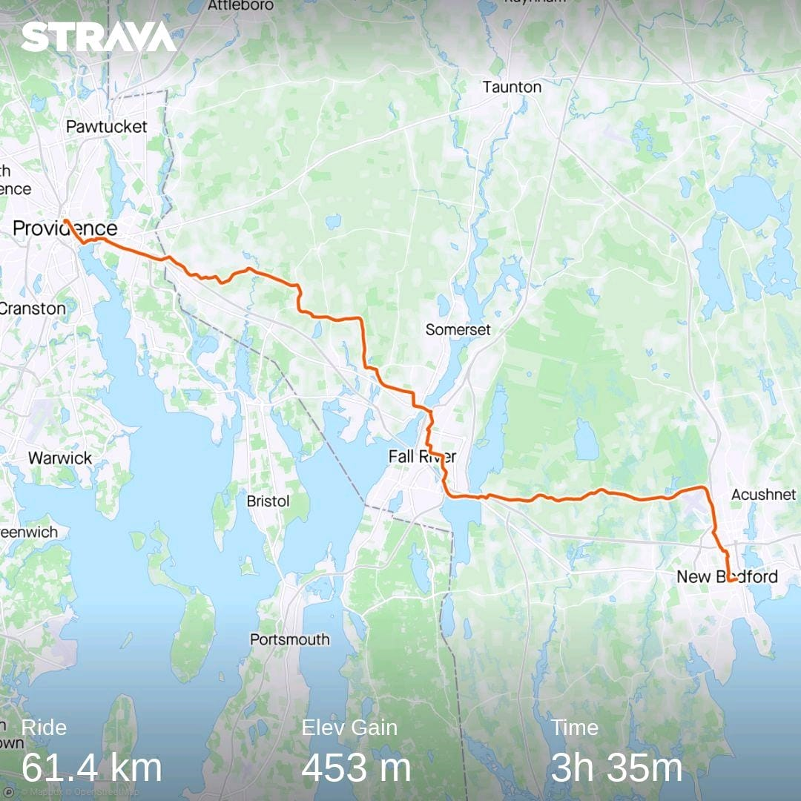
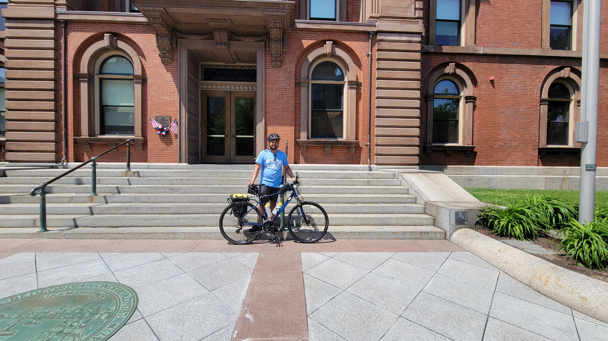
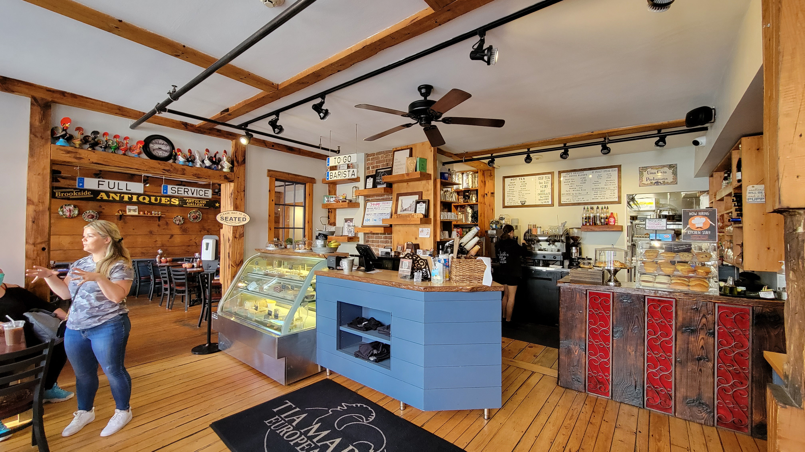
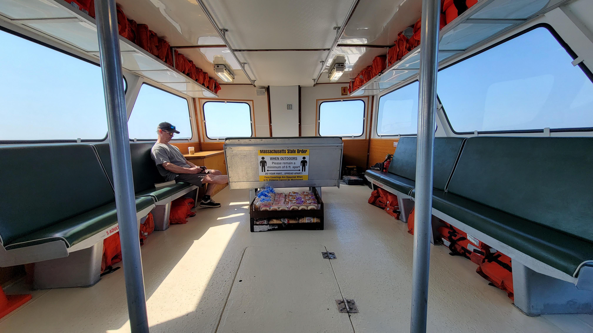
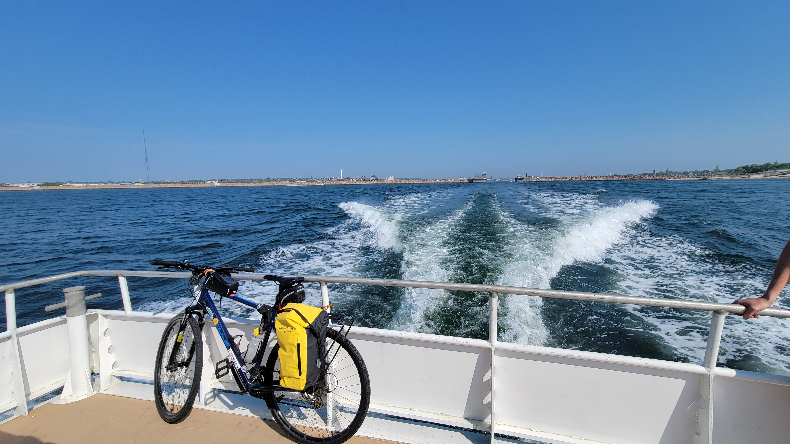
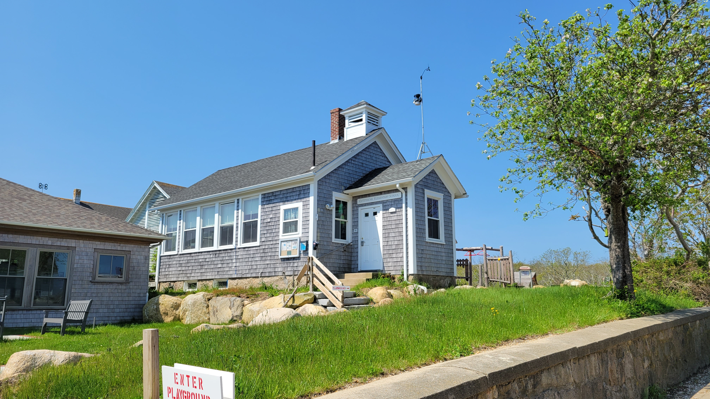
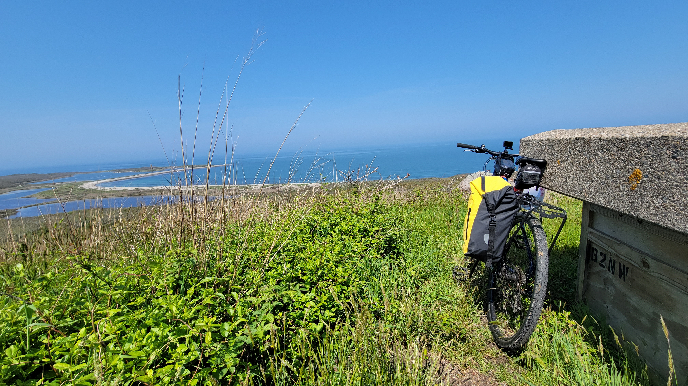
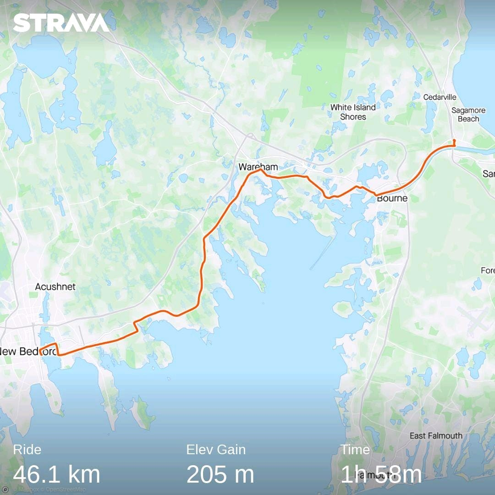
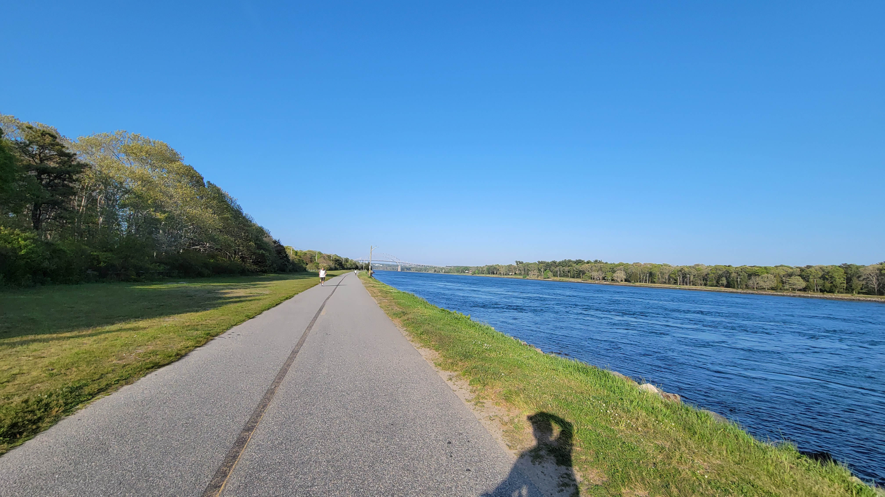

**Ride With GPS Links**

Day 1 - [Providence to New Bedford](https://ridewithgps.com/routes/39498724)

Day 2 - [New Bedford to Bourne](https://ridewithgps.com/routes/39498881)

This ride was the result of mainland Massachusetts anticipating a massive rise in temperatures - 95° F and beyond. The South Coast was supposed to not bear this brunt. As such, I planned a two-day route - first from Providence to New Bedford, and then New Bedford to Bourne with a day-trip out to Cuttyhunk - the only publicly accessible of the Elizabeth Islands which make up the municipality of Gosnold.

Overall, I covered 14 new towns - Seekonk, Rehoboth, Swansea, Somerset, Fall River, Westport, Dartmouth, New Bedford, Fairhaven, Mattapoisett, Marion, Wareham, Bourne, and of course Gosnold - bringing the total to 152/351, thus completing the entire South Coast AND the Elizabeth Islands (well, the only one accessible to the public at least.)

_South Coast ride - Providence to Bourne with Gosnold_

As such, this trip can be divided into three primary segments - 

**1. Providence to New Bedford**

**2. Gosnold**

**3. New Bedford to Bourne**
  
### Providence to New Bedford

_Route of Day 1 - Providence to New Bedford_

I took the 8 am train from South Station to Providence. This train arrives in Providence at 9.11am. Today's ride was supposed to be around 38 miles - which generally with breaks would take me around 3 1/2 to 4 hours. Unfortunately one thing I hadn't anticipated were hills. Two very large hills. And I regret to inform you that they were not nice. The initial hill was right after entering Fall River. The houses and neighborhood I biked through were very nice. The second hill was just before entering New Bedford in North Dartmouth. Right at the top, just as the hill crests is a perfectly placed ice-cream shop on an alpaca farm! I had a cone of coffee ice-cream. The kind ladies behind the counter gave a bottle of ice-cold water for free!

_Ice cream at Hill Crest Alpaca Farm, North Dartmouth_

I ended the 38.4 mile ride in front of New Bedford's City Hall. I still had a couple of hours before I was supposed to check-in to my Airbnb, so I went to the Whaling Museum which was right around the corner.

_Me in front of New Bedford City Hall_

A timelapse video of the route can be viewed on YouTube [here](https://youtu.be/0_4B8X0SWrA/)

### Gosnold

_Roaming around Cuttyhunk Island, Gosnold_

This was the highlight of the entire trip. Despite being a very small portion length-wise, it was the most anticipated.

Day 2 started early in the morning with the [ferry to Cuttyhunk](https://cuttyhunkferryco.com/). This is the only publicly accessible of the Elizabeth Islands which make up the entirety of the municipality of Gosnold. This is the smallest town in Massachusetts by population - 70 according to the 2020 Census. Of these, only around 11 are year-round residents. Its relative isolation being an island is exacerbated by the ferry running only two round-trips a week during non-summer months. There are no shops or restaurants open outside of summer months, and residents haul their groceries in by the ferry from the mainland. Due to this, I packed a couple of sandwiches from Tia Maria's restaurant, which apart from Dunkin' was the only other place open before the ferry was supposed to depart.

_Inside Tia Maria's, New Bedford_

_Bread and groceries being brought to the island by ferry_

_My bike tied to the back of the ferry_

The settlement on Cuttyhunk is clustered primarily on the eastern side of the island right around the harbor. This contains the post office, seasonal grocery store, and the one-room schoolhouse and library. Overall, it was self-contained from the primary necessities point of view.

_The one-room Cuttyhunk Schoolhouse_

The western portion of the island is relatively isolated and uninhabited with only a few large mansions. These are seasonally occupied only. There were a lot of roads with 'No Trespassing' signs, which I was told enthusiastically by more than one local person to ignore.

_Ocean view from a hill on Cuttyhunk Island_

I was able to cover a very large portion of the island in under two hours. I still had about 2 1/2 hours left until the 3 pm ferry back to the mainland. I found a sandy beach area close to the ferry point to wait.

A timelapse video of biking around the island can be viewed on YouTube [here](https://youtu.be/6GEqrOsMpEE/)

### New Bedford to Bourne

_Route of Day 2 - New Bedford to Bourne_

My ferry back to New Bedford took slightly longer than anticipated, and we docked at 4:10pm. I was supposed to catch the 6:35pm bus back to Boston from the Sagamore park-and-ride station in Bourne. The distance I had to cover to reach the bus pick-up point was about 28 miles. Thankfully, the route was extremely flat, and I was able to sustain an average speed of 14.7 miles per hour. I barely made it in time. This is why unfortunately, there are very few pictures for this portion of the route. The highlight for this route however, has to be the Cape Cod Canal trail. It was slightly uphill, but smooth and barely noticeable. The sweeping views of the Cape Cod Canal Railway bridge, Bourne Bridge, and the Sagamore Bridge with the canal waters flowing below and the bike-path to its side were very beautiful.

_Cape Cod Canal trail_

Overall, It was great to escape the potent heat in Boston. Next week is a ride planned out to Orange, starting from Worcester, and returning via Greenfield!