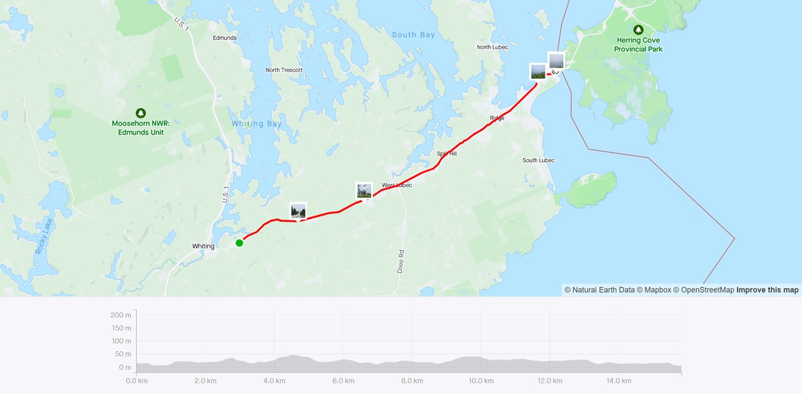
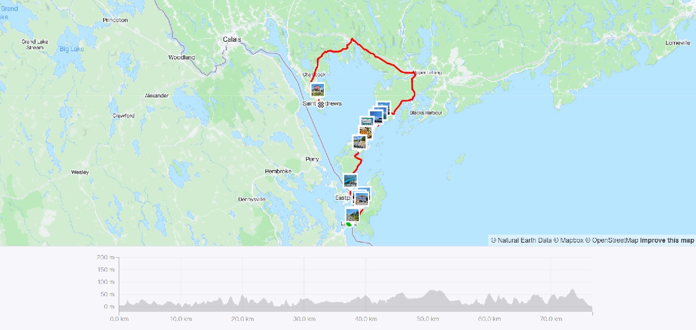
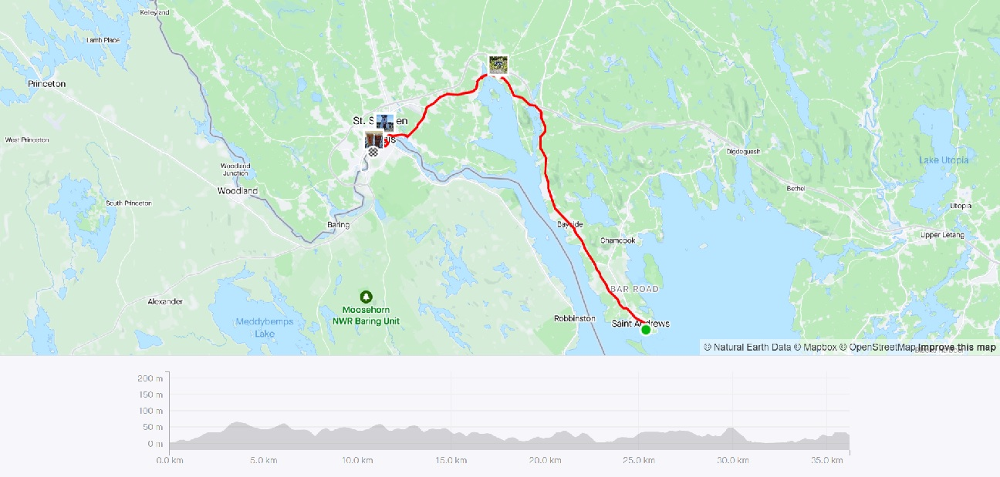

**Ride With GPS Links**

Day 1 - [Whiting ME to Lubec ME - navigated with Google Maps only](https://goo.gl/maps/R1xoUf5f77RWbPW6A)

Day 2 - [Lubec ME to St. Andrews NB](https://ridewithgps.com/routes/40179263)

Day 3 - [St. Andrews NB to Calais ME](https://ridewithgps.com/routes/40181261)

In late July, I quit my job at the MAPC (a wonderful organization and colleagues!!) and joined the IBI Group as a Transportation Planner and Transit Data Analyst. In the few days I had between these two jobs, I decided to complete an item on my bucket list - crossing an international border on my bike! I had initially thought of biking from Burlington VT to Montreal - and complete the final segment of the original Bostreal. However, the complex logistics and high cost of that trip made me shelve that. I realized that I could alternatively bike from Lubec ME! While I had thought doing a longer trip from Lubec to Halifax (mix of bike, ferry, and bus) due to the limited time, I decided on a shorter trip.

Lubec was a good choice. I had already been there the year before with a friend, and I had really liked the town. Back then, the border was closed due to COVID restrictions, and now I was finally going to be able to cross!

*Strava Route Day 1 - Whiting ME to Lubec ME*

 
*Strava Route Day 2 - Lubec ME to St. Andrews NB*

 
*Strava Route Day 3 - St. Andrews NB to Calais ME*

### *Day 1 - Whiting ME to Lubec ME*

### *Day 2 - Lubec ME to St. Andrews NB*

### *Day 3 - St. Andrews NB to Calais ME*
