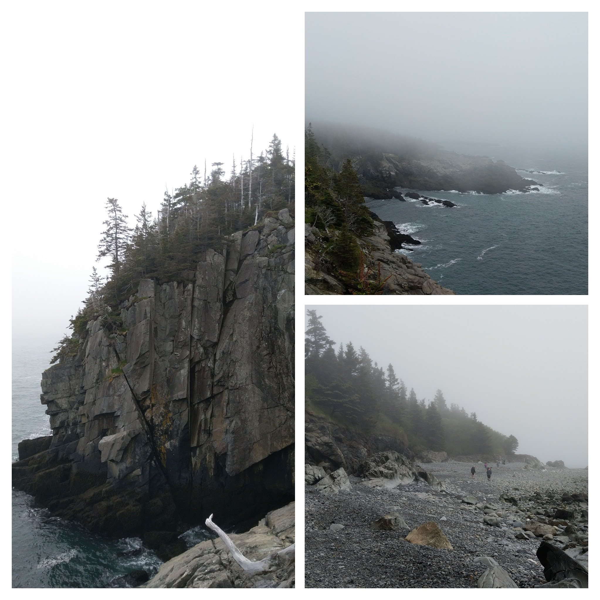
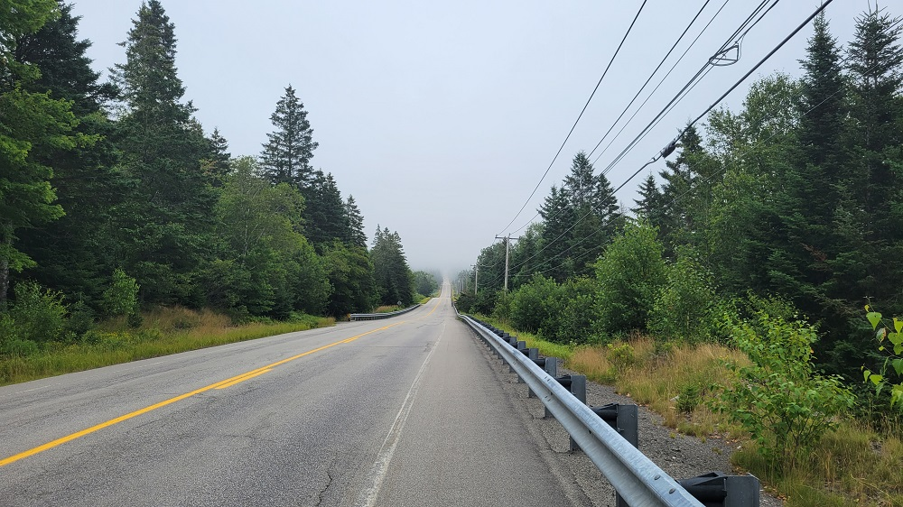
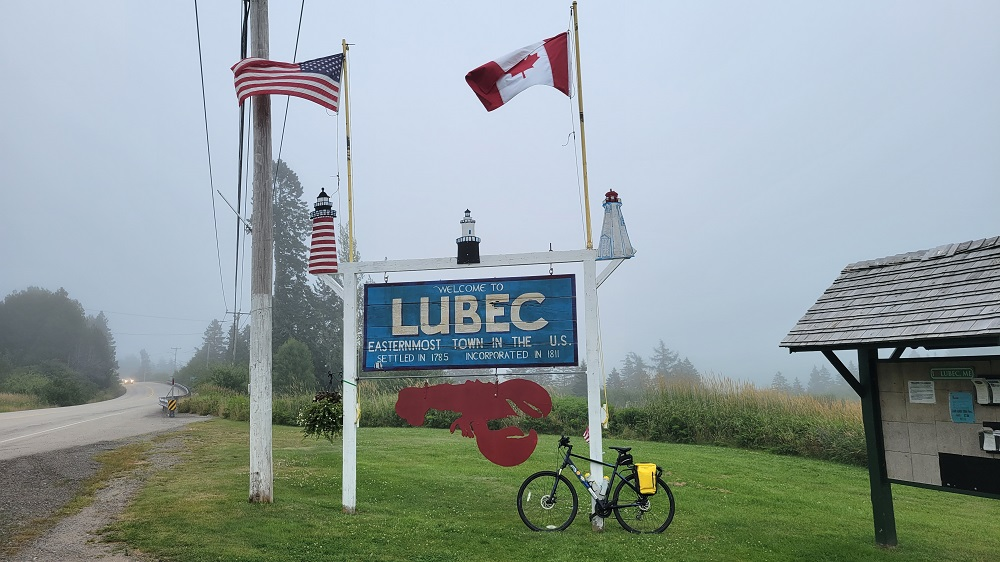
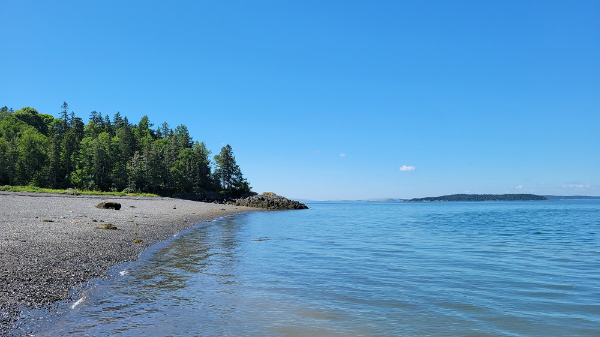
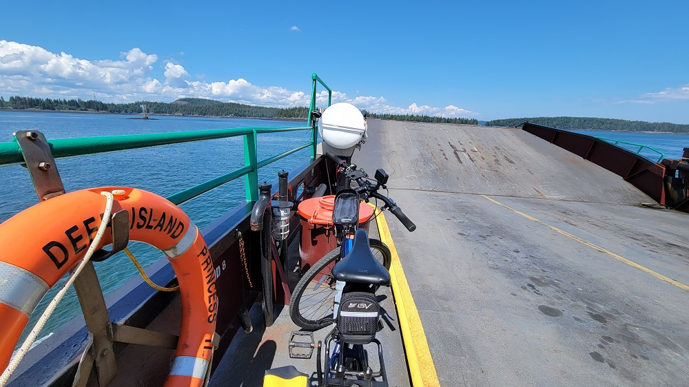
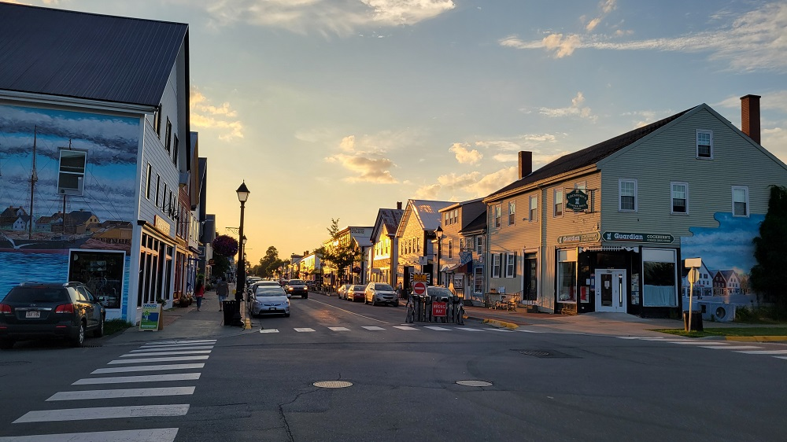
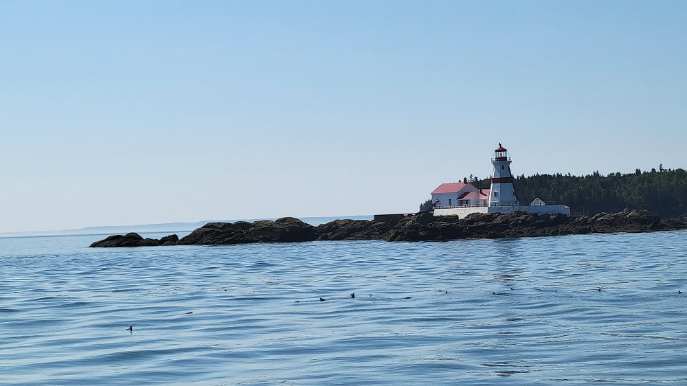
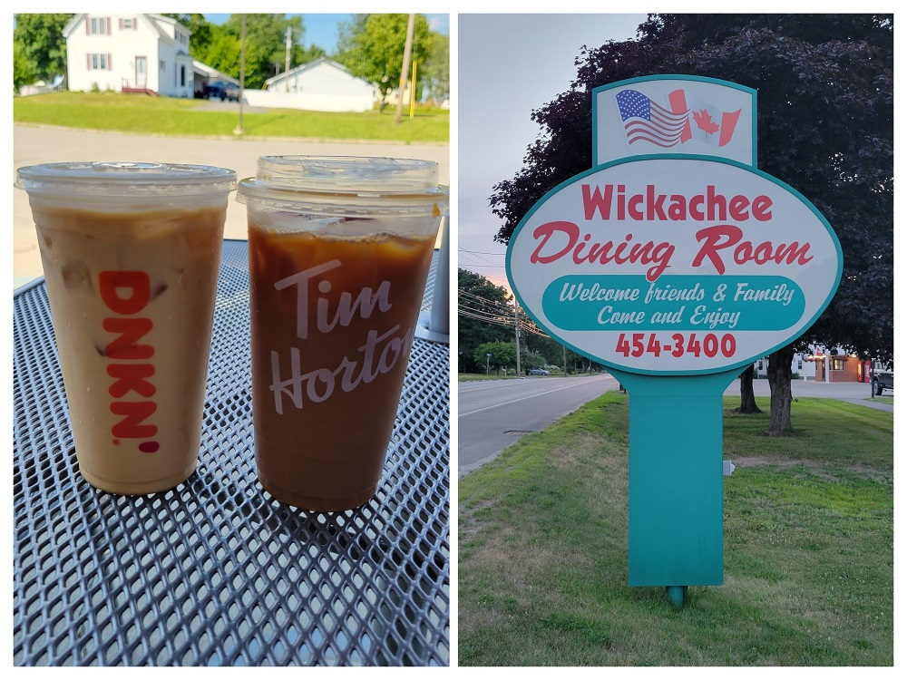

**Ride With GPS Links**

Day 1 - [Whiting ME to Lubec ME - navigated with Google Maps only](https://goo.gl/maps/R1xoUf5f77RWbPW6A)

Day 2 - [Lubec ME to St. Andrews NB](https://ridewithgps.com/routes/40179263)

Day 3 - [St. Andrews NB to Calais ME](https://ridewithgps.com/routes/40181261)

In late July, I quit my job at the MAPC (a wonderful organization and colleagues!!) and joined the IBI Group as a Transportation Planner and Transit Data Analyst. In the few days I had between these two jobs, I decided to complete an item on my bucket list - crossing an international border on my bike! I had initially thought of biking from Burlington VT to Montreal - and complete the final segment of the original Bostreal. However, the complex logistics and high cost of that trip made me shelve that. I realized that I could alternatively bike from Lubec ME! While I had thought doing a longer trip from Lubec to Halifax (mix of bike, ferry, and bus) due to the limited time, I decided on a shorter trip.

The last time I was in Lubec, was in June 2021 with a friend. We went to the Quoddy Head State Park. The scenes were other-worldly!

*Quoddy Head State Park, Maine*

Lubec was a good choice. I had already been there the year before with a friend, and I had really liked the town. Back then, the border was closed due to COVID restrictions, and now I was finally going to be able to cross!

*Strava Route Day 1 - Whiting ME to Lubec ME*

 
*Strava Route Day 2 - Lubec ME to St. Andrews NB*

 
*Strava Route Day 3 - St. Andrews NB to Calais ME*

This ride, just like the Connecticut River Connect, from Brattleboro to Greenfield was not part of the ride351 challenge. However, it was, just like that ride - a very amazing bike trip. Lubec is very far from Boston. It took me 3 buses, and an entire day to just get there. In short, I took the [Concord Coach](https://concordcoachlines.com/) bus from Boston to Bangor, and then [West Bus Service](http://www.westbusservice.com/) from Bangor to Whiting - from where I biked to Lubec. Do note, that West Bus Service takes cash only, which has to be paid at the Concord Coach station in Bangor, and extra for bikes. Please confirm by phone before you go. Concord Coach tickets can be bought online on their website.

### *Day 1 - Whiting ME to Lubec ME*

The bus ride from Boston to Whiting took three changes, with a two-hour layover in Bangor. The Bangor bus terminal is in the middle of a strip-mall area. Absolutely not nice, but its fine. Concord Coach buses were the regular tour buses, but West Bus Service buses are just large minivans. There tend to be not more than 3-4 passengers. The entire journey from Boston to Whiting takes about 9 hours, and the bus drops you off at Whiting at about 5pm. From there, its about 11 miles on bike to Lubec.

*In West's Bus Service bus from Bangor to Whiting*

Lubec lies on a small peninsula, jutting out into the waters of the Bay of Fundy. This gives it a San Fransisco like quality and has its own highly distinct micro-climate. The rest of New England was going through a heatwave, with temperatures in the mid to upper 80s. Lubec was a cool 65. This also results in a lot of fog! It was extremely interesting to start in hot weather in Whiting, and - just 11 miles away, shivering.

*Road from Whiting to Lubec*

*Welcome Sign at the entrance to Lubec*

*Cohill's Inn in Lubec - where I stayed the night*

I stayed at Cohill's Inn for the night. While not the cheapest option, I was on a bit of a vacation, so thought of spending more than I would've otherwise. When the innkeeper realized that I was biking into Canada, he even gave me a beer on the house! He definitely has me as a customer for life.

*Water Street, Lubec; a ravioli meal at the Water Street Tavern, and the Guinness comped by my innkeeper*

### *Day 2 - Lubec ME to St. Andrews NB*

This day, I was finally going to cross the US-Canada border on a bike! I was so excited, it is beyond ridiculous. It was a foggy morning, as it often is in Lubec, and I was worried that it might rain - but it did not.

*Campobello Bridge, across the Lubec Narrows enveloped in dense fog!*

New Brunswick is on the Atlantic Time Zone, which is one hour ahead of Eastern Time Zone - which Maine is in. My phone had already switched to the Atlantic Time Zone, while my watch was still in Eastern. This helped me keep track of times in both sides of the border. I had timed my departure time keeping in mind the ferry times. I was going to take two ferries today - the first one from Campobello Island to Deer Island, and then another one from Deer Island to the mainland at L'Etete. Schedules to both ferries are listed [here](http://deerisland.nb.ca/ferries.htm). Campobello-Deer island ferry is every hour from 9 am to 7 pm, and between Deer island and L'Etete is every thirty minutes from 8 am to 5pm. There are ferries outside these hours too, but at reduced frequencies.

My border formalities happened only on the Canadian side. While crossing between the US and Canada, you only need to do this at the border office of the country you are entering. The road from the border to the ferry point is not the nicest. It's far too wide and has a long slow gruelling climb. It took me a little longer than anticipated, and the ferry had just left when I got there, so I chilled on the docks.

*Beach at the Campobello Island to Deer Island ferry point*

*On the Campobello Island to Deer Island ferry*

*Getting off at Deer Island*

Deer island was filled with small, low traffic hilly roads, and it was really nice. I had timed my ride to ideally stop at [Ocean View Takeout](https://www.google.com/maps/place/Ocean+view+takeout/@45.0083885,-66.9403911,15.24z/data=!4m5!3m4!1s0x4ca8a1df33626b2f:0x1e7a9123ab5e4834!8m2!3d45.0078878!4d-66.9422936) in time for lunch. But because my initial ferry was later than expected, I got there at peak lunch time, so of course there was a wait. But the food was worth the wait.

*Fried Scallop plate on Deer Island*

*Winding road on Deer Island*

*On the Deer Island to L'Etete ferry*

After getting on the mainland, my route was divided into three distinct portions:

* 1. L'Etete to Saint George

This part of the ride was relatively straightforward - not unlike a lot of New England biking. Because of the ferry delays, it was already after 4pm by the time I got to Saint George. Its your standard small town - pretty in a non-descript way. I had no reason to stop except to fill up my water bottles at a gas station, and then I was off towards Saint Andrews.

* 2. Saint George to Exit 39 on NB-1

This portion of the ride was equal parts dreadful, and exciting. The dreadful portion was from Saint George to Bethel. It was a blisteringly hot, dry, and sunny day - and the road I was biking on was wide with a steady incline. The only saving grace was getting ice-cream at [Ossie's Lunch](https://www.google.com/maps/place/Ossie's+Lunch/@45.1588239,-66.916646,16.28z/data=!4m5!3m4!1s0x4ca61bfa3fe73b8f:0xb0d307fb366693ae!8m2!3d45.1583197!4d-66.9160456) just before getting onto the highway. After a brief ice-cream stop, and with no desire to stay longer than necessary, I started heading towards NB-1.

NB-1 looks like a controlled access highway with interstate-style exits. However, I was surprised to learn that bicyles are allowed on this road. This may be due to relatively low traffic, as well as, the only other alternative route being many extra miles long. And also, I was very interested in getting that 'Biking on the Interstate' feel! It was exhilarating, biking on this high-quality highway, and taking an actual 'exit'! I have a gopro video of this portion which I've unsuccessfully tried to upload on my Youtube channel, but hopefully will some day.

* 3. NB-1 to Saint Andrews.

After turning off NB-1 at Exit 39, I was on my way to Saint Andrews, and I finally got to the edge of town around 6.30 pm. Plenty of time for the sunset for late July, but I was tired, and hungry from biking in the hot sun all day. The first place I stopped, was of course, to sample local cuisine - Timmies!

*Sampling local cuisine, and embracing the local culture*

St Andrews is a really nice tourist town. I stayed at the [Salty Towers B&B](https://www.google.com/maps/place/Salty+Towers/@45.071421,-67.047293,15z/data=!4m2!3m1!1s0x0:0x1a0f7b7af1432b22?sa=X&ved=2ahUKEwjfso7P7N78AhXsD1kFHZZYBuMQ_BJ6BAhoEAc), had a nice beer at the [Saint Andrew Brewing Company](https://www.google.com/maps/place/Saint+Andrews+Brewing+Company/@45.0737055,-67.0537381,19.02z/data=!4m15!1m9!3m8!1s0x0:0x1a0f7b7af1432b22!2sSalty+Towers!5m2!4m1!1i2!8m2!3d45.071421!4d-67.047293!3m4!1s0x4ca8a9c12e5b35df:0x4a17a2fc12572211!8m2!3d45.0734796!4d-67.0530218) and called it a day, watching a gorgeous sunset.

*A beer from the Saint Andrew Brewing Company, and the inside of the Salty Towers B&B*

*Looking down Water Street at sunset*

*View of Saint Andrews Harbor*

### *Day 3 - St. Andrews NB to Calais ME*

Today, I had planned to go on a whale-watching tour. I rarely do these kinds of things, especially when on a bike ride. But with the bus schedules being the way they were, I was going to have to spend one more night in Calais. As such, I had no particular hurry to get to my end-point.

The whale-watching was fun. I think we saw one juvenile (pilot?) whale, and several dolphins. It was quite chilly out on the water, even in late July!

*Some dolphins, and our boat*

*Head Harbor Lightstation*

After a brief whale-watching, I was on my way to Calais ME! After crossing the border, I realized that I * need * to do a Tim Hortons - Dunkin iced coffee face-off. As a patriotic Greater Bostonion, it is with a heavy heart that I concede to the Canucks. Timmies is superior, sorry.

*Timmies - Dunkin face-off*

As my first cross-border bike ride, this was FUN. I am glad I did it. It seems like the only mode of transport I hadn't used to cross an international border was a bike, and now it is done!

I had the worst calzone in my life in Calais ME - that's on me.
