**Ride With GPS Links**

Day 1 - [Greenfield to Shelburne Falls](https://ridewithgps.com/routes/38906752)

Day 2 - [Shelburne Falls to Northampton](https://ridewithgps.com/routes/40624752)

As mentioned in my previous post, I both enjoy, and dread a cross-Berkshire hills ride. For this one ride, I had a massive 1200' uphill climb over 5 miles, with no place to stop for refreshments until the very peak of the climb. This was the path of least resistance to cover these rural towns. The rural towns north of Route 2 are extremely remote (by Massachusetts standards) and most have nothing more than a cluster of a few houses here and there. The highlight of this ride was the Heath Fair. I was lucky to have caught it on this weekend.

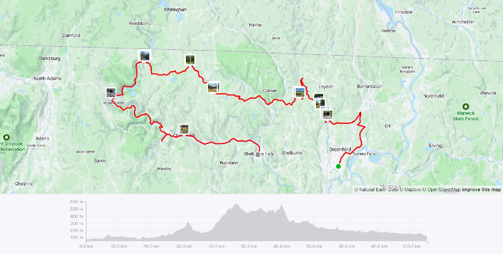
*Strava Route Day 1 - Greenfield to Shelburne Falls via Monroe*

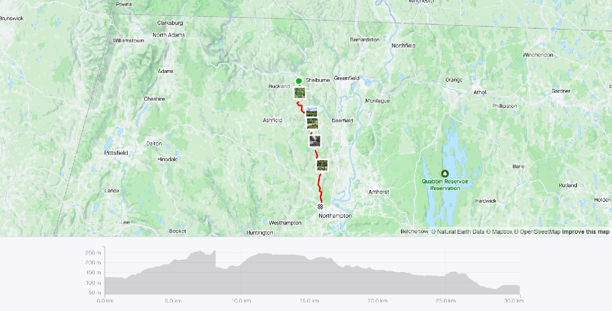 
*Strava Route Day 2 - Shelburne Falls to Northampton*

The first day of this ride was going to be a long, and arduous 67 hilly miles, and I would have had to start very early in the morning. Due to no transportation options dropping me this early to Greenfield from Boston, I had to leave the evening before, right after work. I took a (yes again) Peterpan bus from Boston to Springfield, and transferred to the Vermonter train which dropped me off at Greenfield later that night.

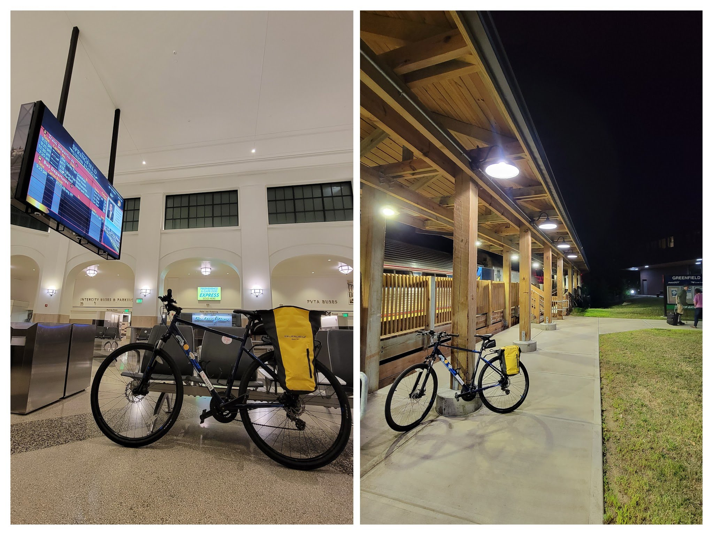
*My bike at Springfield Union Station, and again at Greenfield Station*

### *Day 1 - Greenfield to Shelburne Falls*

I started from Greenfield pretty early in the day, hoping to be in Shelburne Falls by early evening (this proved to not be true). After a decently sized breakfast, I was on my way. This also happened to co-incide with the [D2R2 ride](https://www.franklinlandtrust.org/d2r2/), so it was fun seeing other bikers out and about, and them probably thinking that this guy is capable of doing D2R2 (I'm most definitely not).

The first part of the ride starting from Greenfield, took me along the Green River, on the Green River Road. This part was co-incident with a portion of the D2R2 route, and it was fun seeing other bikers as well.

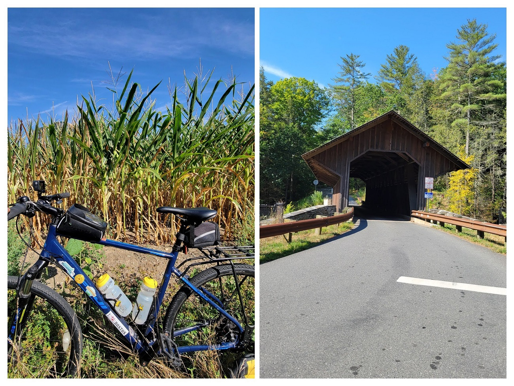
*Eunice Williams Covered Bridge*

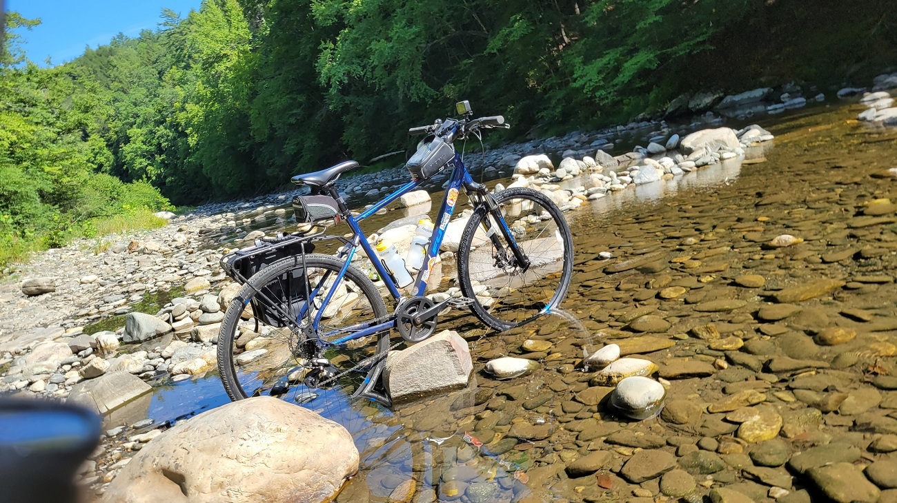
*My bike chilling in the Green River*

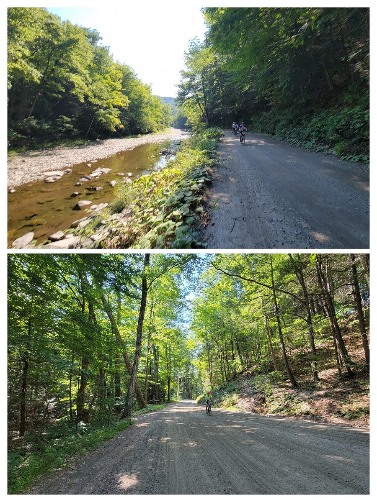
*D2R2 riders on the Green River Road*

##### Heath Fair

A big attraction on this ride was the Heath Fair - a rural agricultural fair in the town of Heath. I had never been to an American agricultural fair before, and this was a great opportunity to bike to one. After a mega-tiring 1200' uphill climb, I finally got to the Heath Agricultural Society's Fairgrounds. It was a small event, and I couldn't stay too long, but I had some fried bread, a beer, and listened to some good music in a shaded tent (it was hot that day!) Be sure to carry cash - almost no-one took cards, and I had to ration whatever I had.

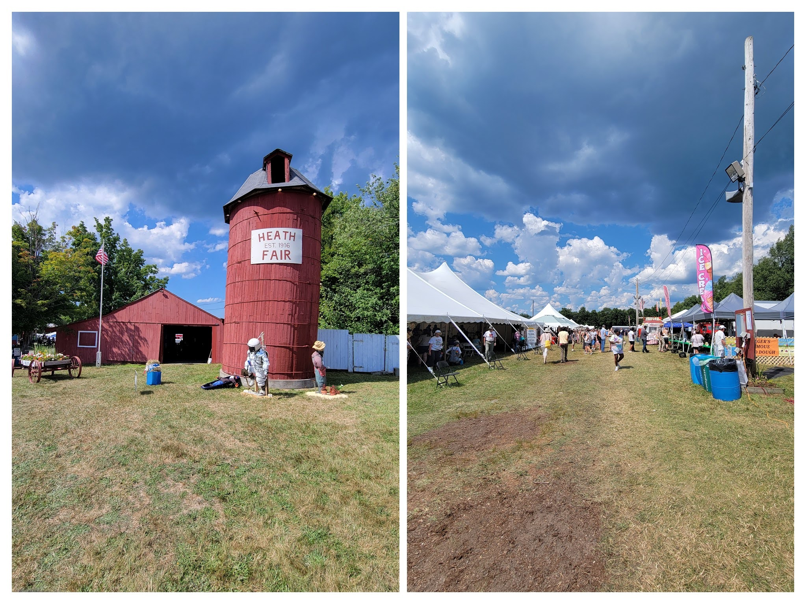
*Heath Fair*

After the Heath Fair, I had a long, and beautiful, and breezy descent into Monroe, and the Deerfield River valley. The settlement of Monroe Bridge had just one street with a few houses, and some municipal offices at the T-intersection.

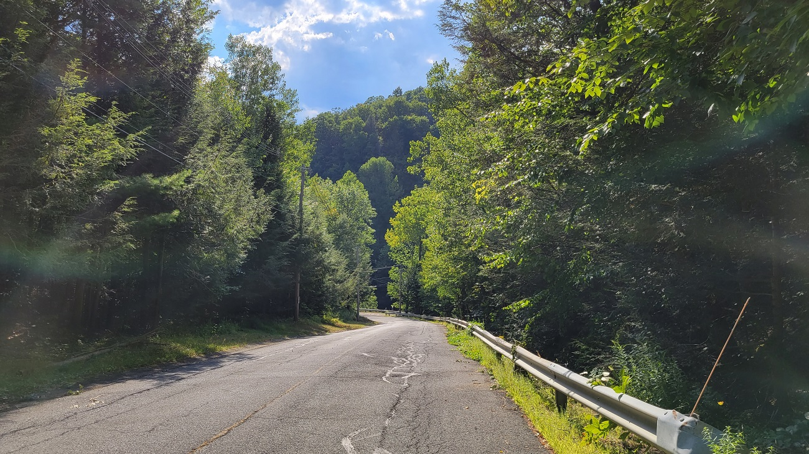
*Approaching Monroe from Heath*

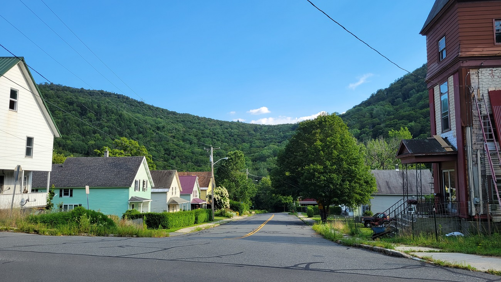
*The settlement of Monroe Bridge*

After a brief pause relaxing under a tree in Monroe Bridge, I stopped next at the east entrance of the [Hoosac Tunnel](https://www.google.com/maps/place/Hoosac+Tunnel,+East+Portal/@42.6752341,-73.0294273,13z/data=!4m5!3m4!1s0x89e0c607d419f495:0x4f03c74206650a01!8m2!3d42.675233!4d-72.9978812). The Hoosac Tunnel is an important East-West railroad connector in North-Western Massachusetts.

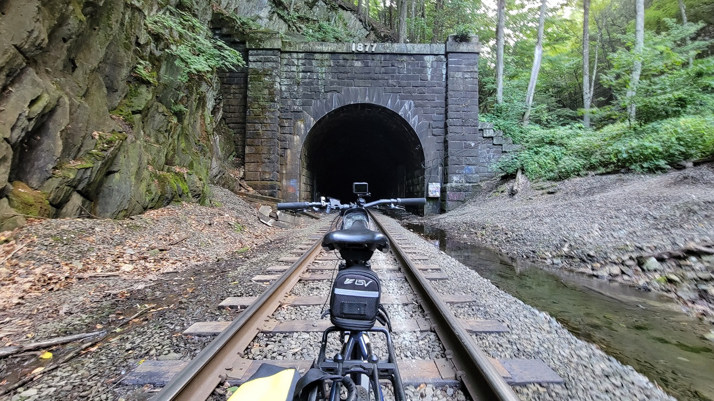
*East Portal of the Hoosac Tunnel*

After an extremely tiresome last push, I finally made it to Shelburne Falls. It was relatively dark by the time I got in, with just enough time to freshen up, and grab a bite before sleeping.

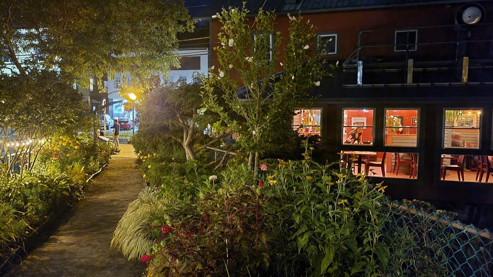
*The Bridge of Flowers, in Shelburne Falls at night looks very different than in the daytime!*

### *Day 2 - Shelburne Falls to Northampton*

On day 2, I had to ride to Northampton in time to catch the bus back to Boston. I planned a 24 mile ride, trying to cover as many towns in as few miles as possible. 

There were some nice views on the way to Northampton, with lots of fields, and shallow valleys.

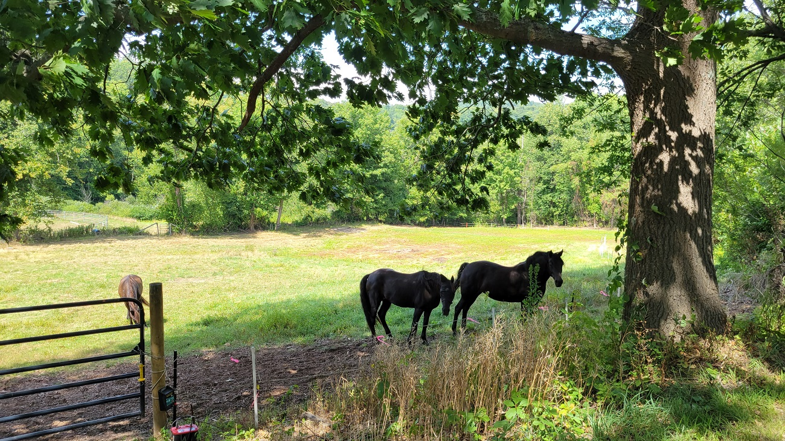
*Horses in a field, in Conway*

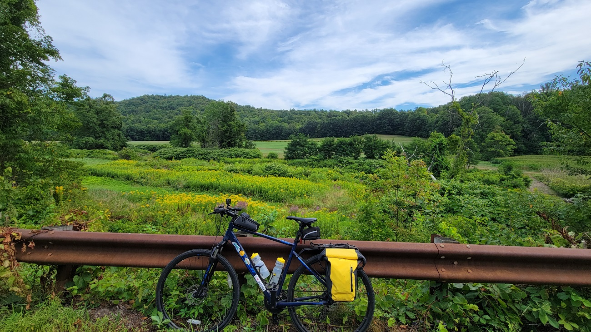
*My bike in front of a field of flowers in Conway*

I got to Northampton in time to catch a cider at the [Artifact Cider Project](https://www.google.com/maps/place/Artifact+Cider+Project/@42.3378061,-72.675443,17z/data=!3m1!4b1!4m5!3m4!1s0x89e6d7d99064da2d:0x1e1edbe72455b543!8m2!3d42.3378061!4d-72.6732543!5m1!1e4). I had tried some of their cider at their Cambridge taproom, and was happy to try it in their Northampton brewery.

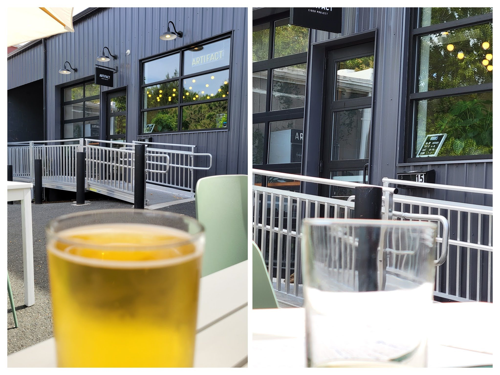
*Cider at Artifact Cider's brewery in Florence, Northampton*

Crossing the Berkshire hills by bike is extremely rewarding. I have only a few more rides left to cross.

### BONUS SECTION Town-Line Signs

One thing about biking in Massachusetts (this is probably true in other places too) is that you see some really cool town-line signs. Apart from the well-known 'open book' style town signs, many rural and low-density areas also have simpler, rectangular signs with the towns' names on either side of the sign. Along this route, I saw quite a few. The funniest combination was at the border of towns 'Heath' and 'Rowe' - alluding to the busy airport.

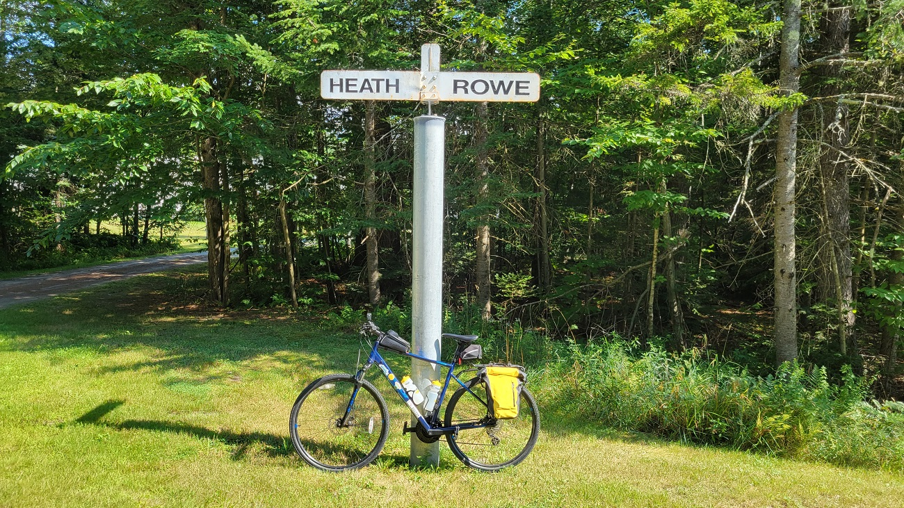
*Heath & Rowe Town-line Sign*

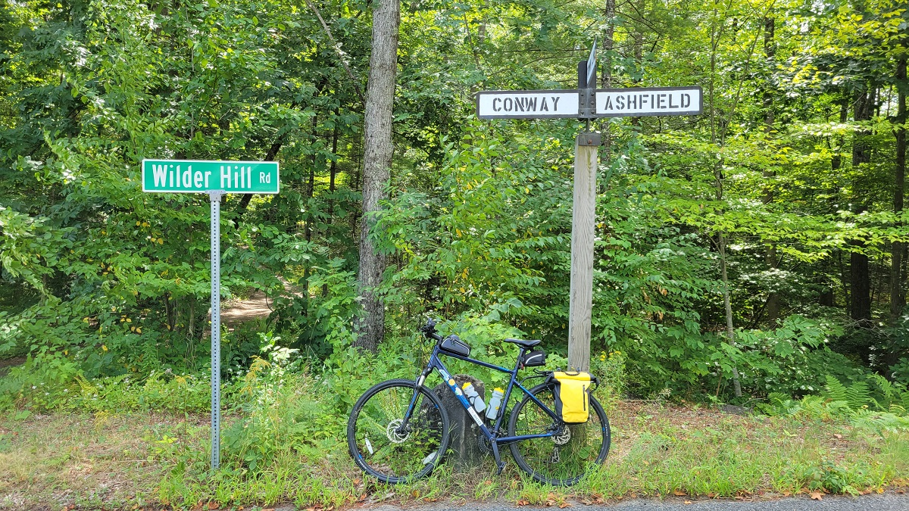
*Conway & Ashfield Town-line Sign*

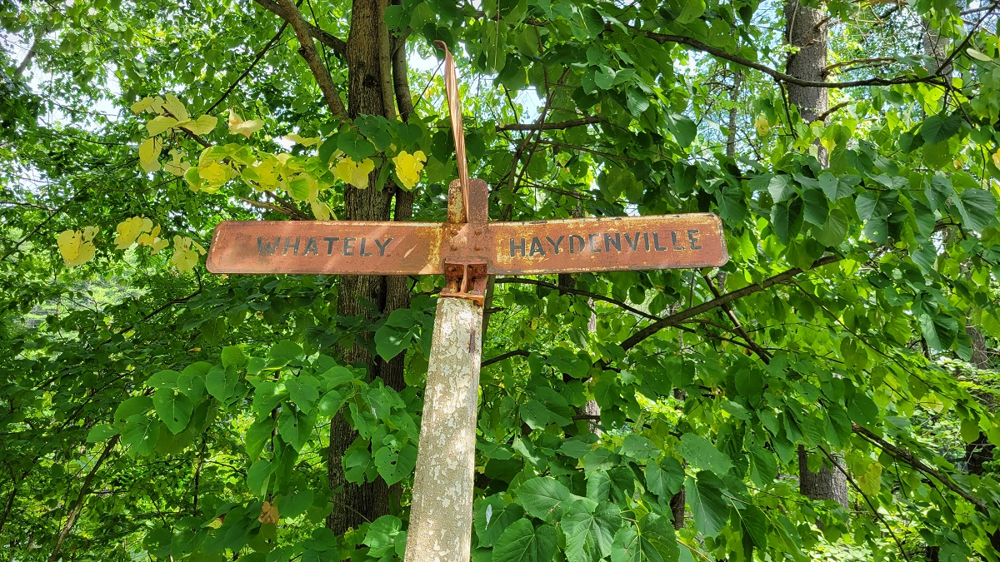
*Whately & Haydenville (Williamsburg) Town-line Sign*

Overall, I covered 9 new towns - Bernardston, Hawley, Rowe, Ashfield, Monroe, Williamsburg, Health, Colrain, and Leyden - bringing the total to 192/351.

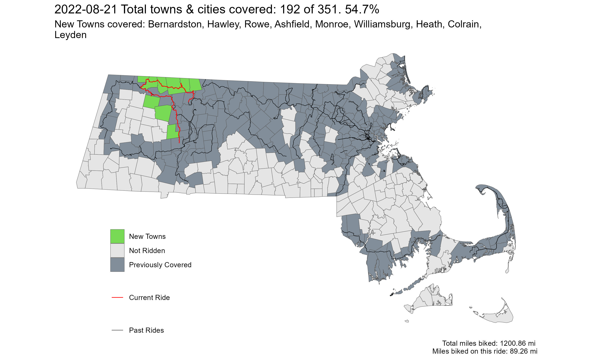
