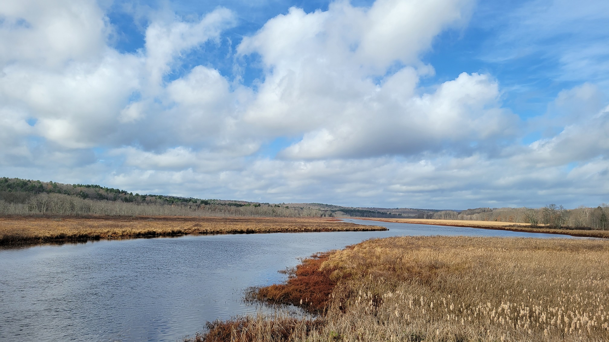
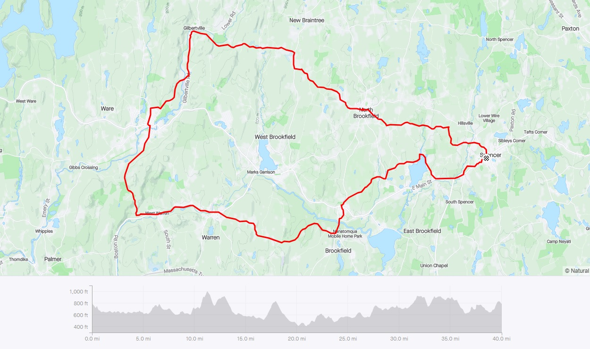
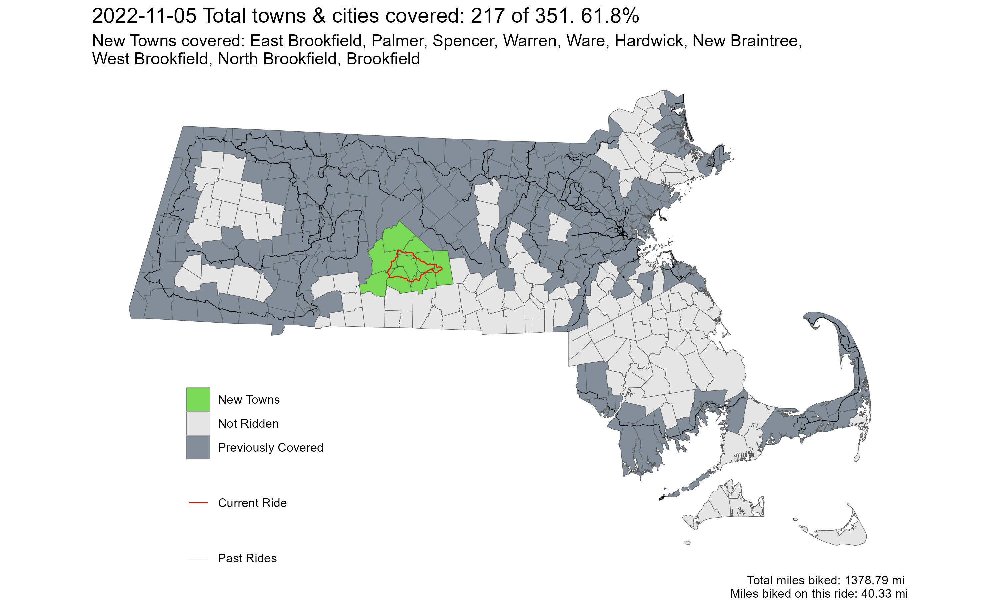

[**Youtube Link**](https://youtu.be/LeS4PXPavpI?feature=shared)

**Ride With GPS Links**
[Central Massachusetts Loop](https://ridewithgps.com/routes/41322762)

This was one of the few rides I did that I drove to. Well, my friend drove us and our bikes to. These towns are served by the WRTA 33 and 19 routes, which I would've taken had I gone alone. It was a beautiful early November/late Fall day with the bright fall colors slowing down from the October riot. With partially clear skies, the landscape was dominated by blue, brown, and deep golden-brown. I feel November is not appreciated enough.

 
*The Quabog River*

 
*The route also passes by the historic Boston Post Road!*

 
*Strava Route - Central Massachusetts Loop*

Overall, I covered 10 new towns - East Brookfield, Palmer, Spencer, Warren, Ware, Hardwick, New Braintree, West Broofield, North Brookfield, and Brookfield - bringing the total to 217/351 - 61.8%!

