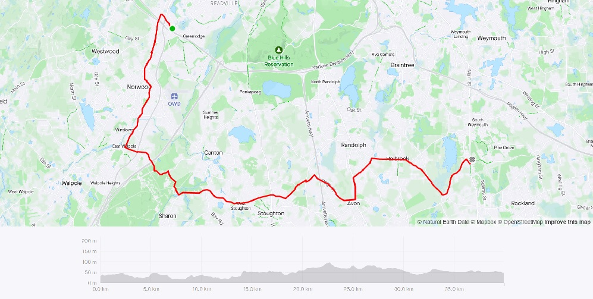
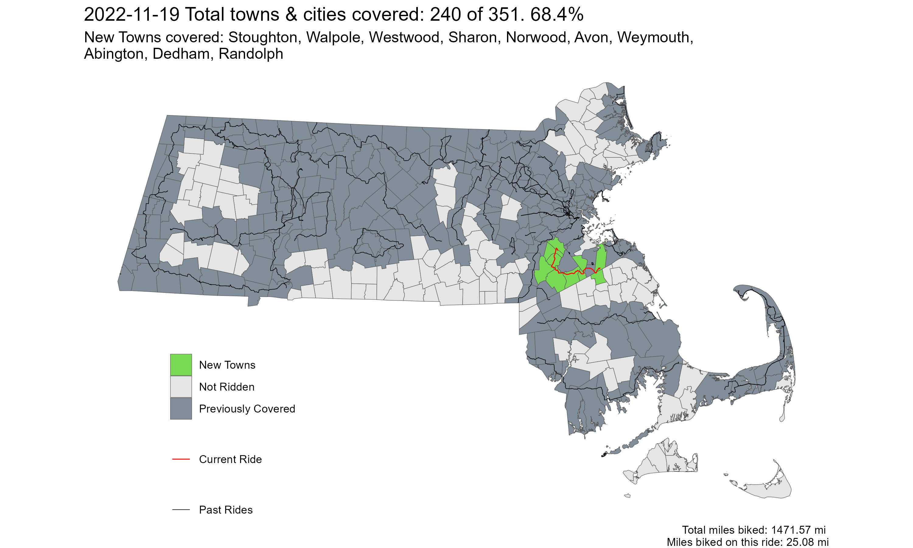

**Ride With GPS Links**

[Dedham to Weymouth](https://ridewithgps.com/routes/41422679)

If you thought the last ride from Attleboro to Plymouth was bad - I have worse news for you. This section of the state is terribl-er. The entire route I was battling SUVs and pick-up trucks. It was a series of long stretches of stroads only. This ride had only one redeemable section - which unfortunately was also uphill. I highly recommend not riding this section unless you're doing something as daft as biking all across the state.

*My exhausted face, which got more exhausted after it saw this sign at South Station on the way home*

*Strava Route - Dedham to Weymouth*

Overall, I covered 10 new towns - Stoughton, Walpole, Westwood, Sharon, Norwood, Avon, Weymouth, Abington, Dedham, Randolph - bringing the total to 240/351 - 68.4%, crossed the two-thirds mark!

