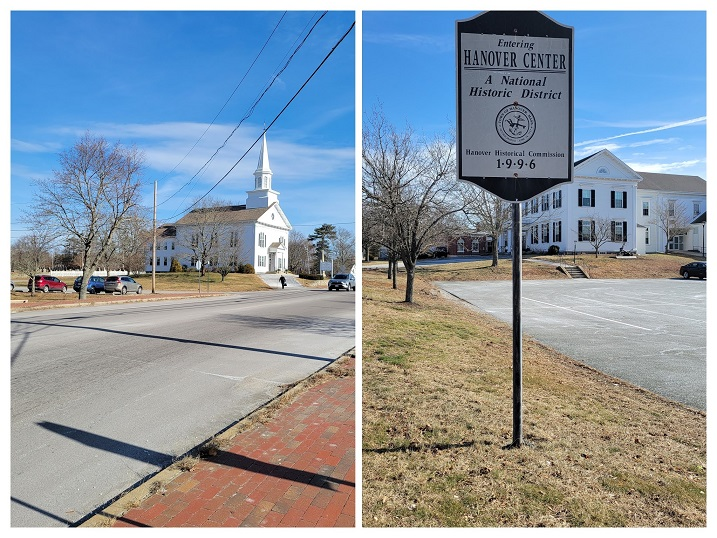
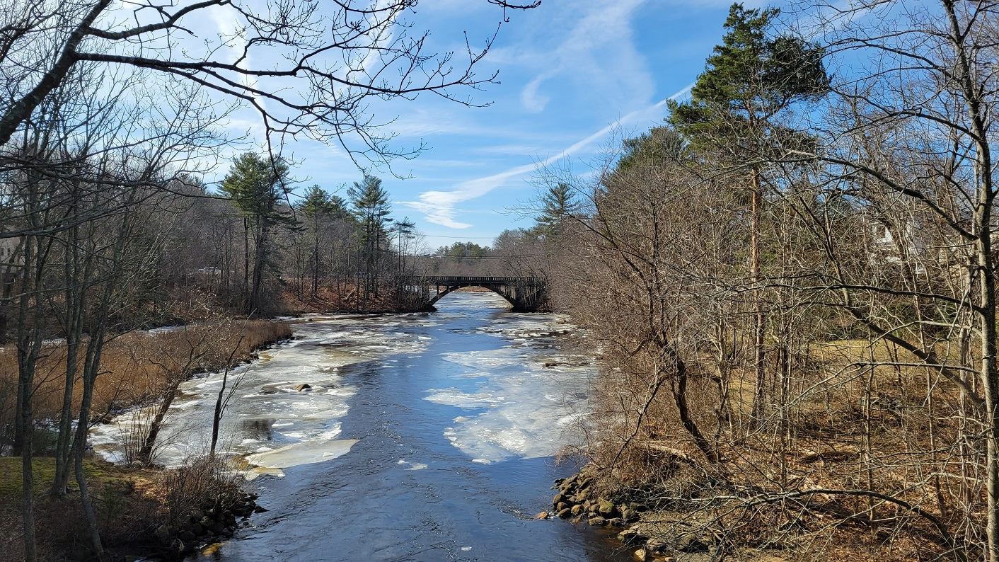
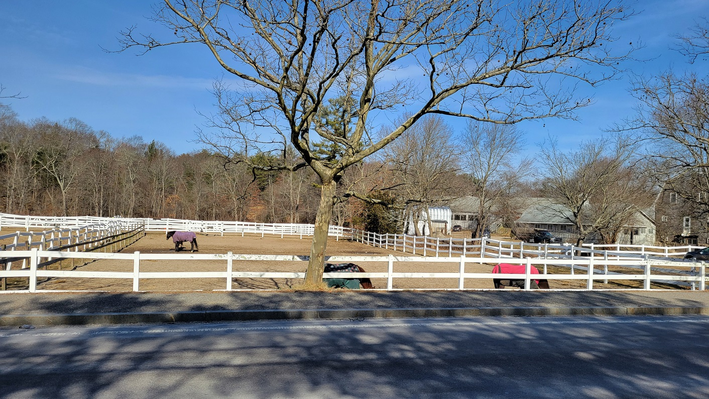
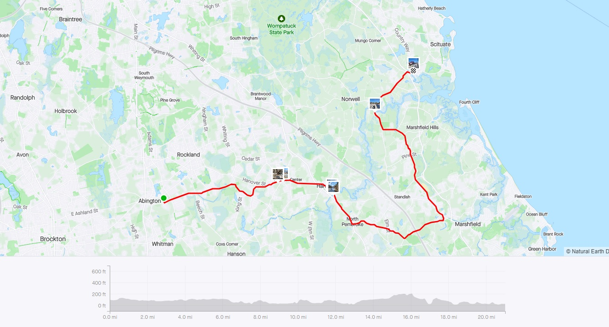
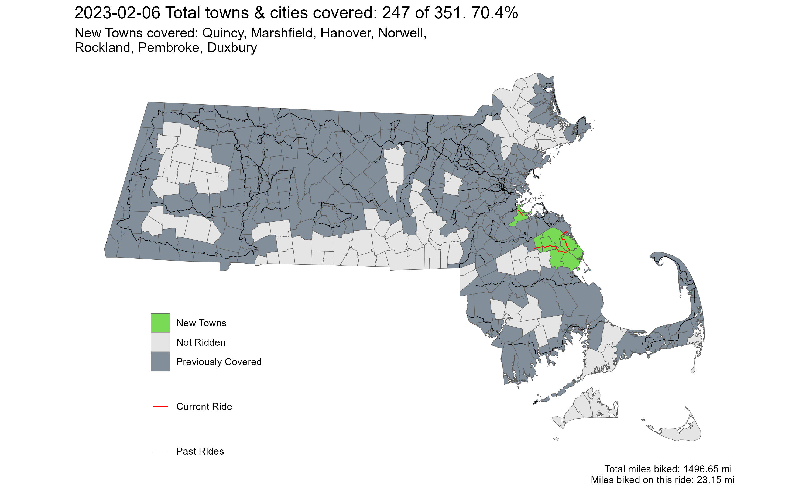

[**Youtube Link**](https://youtu.be/p-PXjQ1j7DY?feature=shared)

[**Ride With GPS Link**](https://ridewithgps.com/routes/41722735)

January and February are the coldest months in Boston with temperatures rarely above freezing, let alone warm enough to ride a bike. The day before this ride New England experienced [extremely frigid temperatures](https://www.axios.com/2023/02/02/new-england-polar-vortex-cold-snap) due to a polar vortex. Literally overnight, temperatures soared from 17 F to 50 F daytime maximum. Such temperature swings are not unheard of here. With such a nice sunny, (relatively) warm Sunday, I decided to set off on a ride!

This ride is just to the south of Wompatuck State Park - one of my favorite forested spots near Boston. The roads were better than the regular suburban high stress roads, and I managed to find a few nice low stress portions through residential areas. This is a very historic region of Massachusetts with some of our oldest settlements. Hanover town center was particularly nice.

 
*Hanover Town Center*

 
*The semi-frozen North River in North Pembroke*

 
*Horses grazing with their winter blankets*

 
*Strava Route - Post Freeze Thaw*

Overall, I covered 7 new towns - Quincy, Marshfield, Hanover, Norwell, Rockland, Pembroke, and Duxbury - bringing the total to 247/351 - 70.4%!

