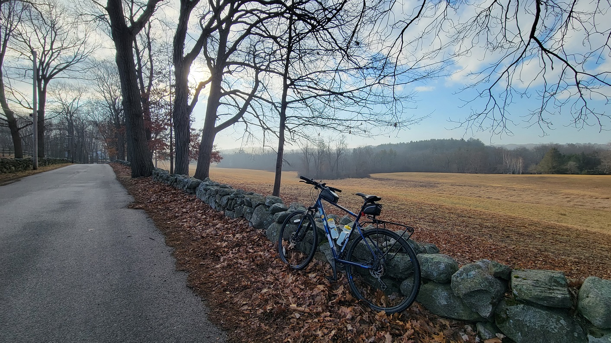
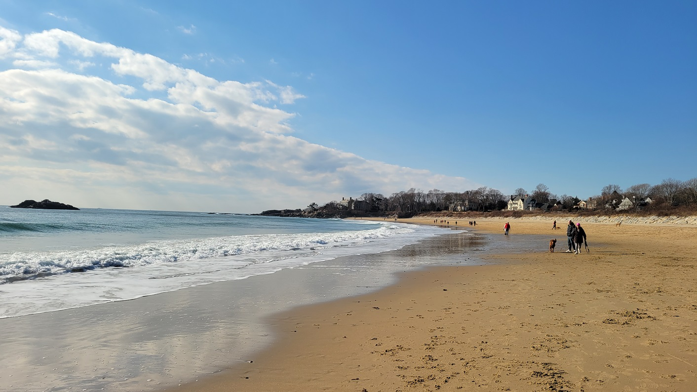
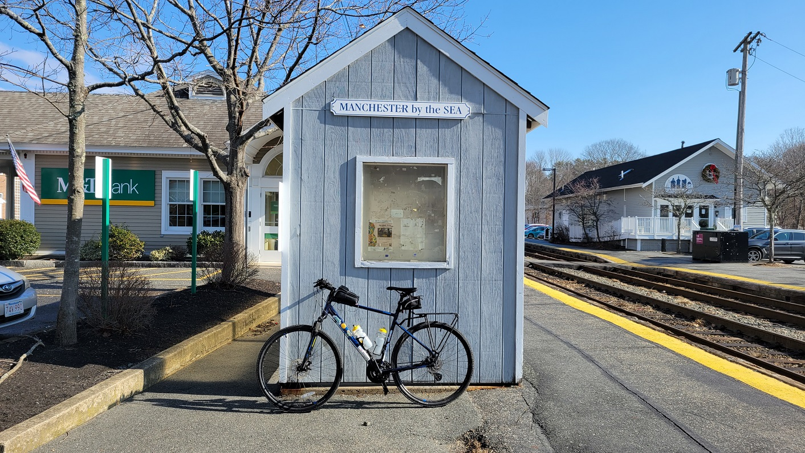
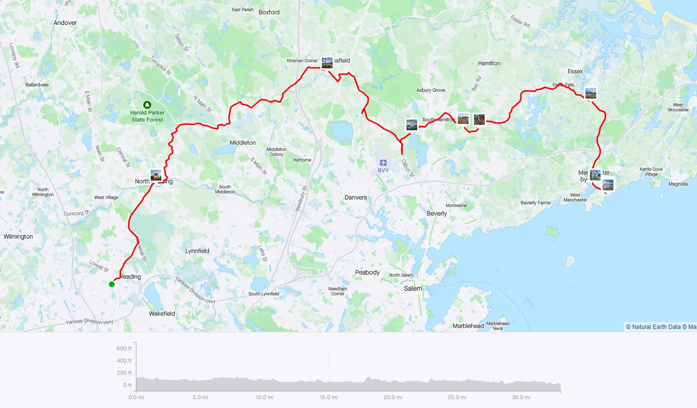
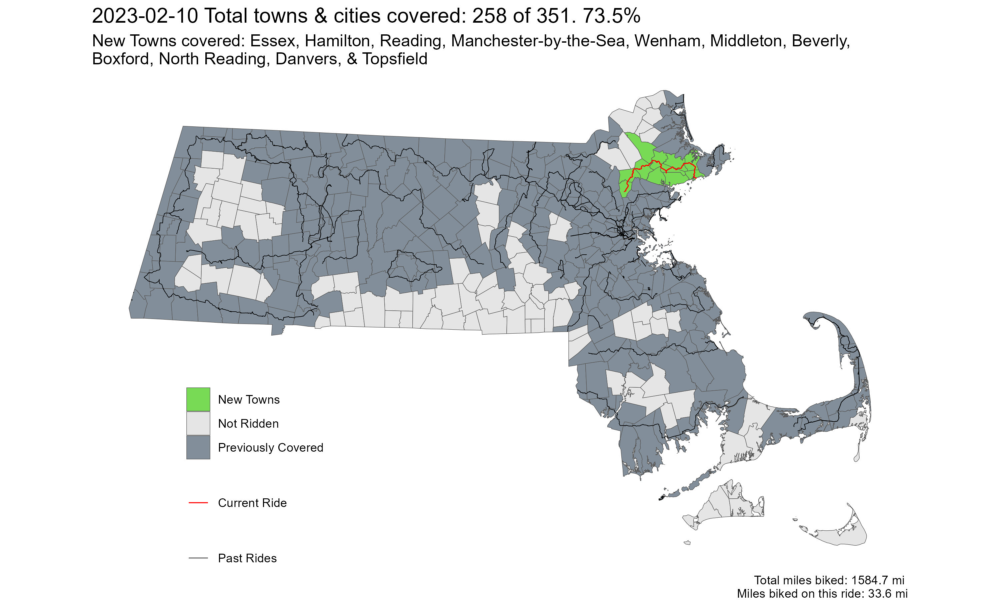

[**Youtube Link**](https://youtu.be/p-PXjQ1j7DY?feature=shared)
[**Ride With GPS Link**](https://ridewithgps.com/routes/41722735)

Another warm-ish day in February. We don't waste those in this part of the world. This ride was a combination of two shorter rides. The route was nice, with no/low traffic, and went through some residential streets, and low-traffic connector roads. After crossing I-95, it became less bedroom-community-ish, and more classic North-Shore village like atmosphere. Towards the end, however, it becomes a little hilly along a busy-ish road and an intersection with 128, but ends at Singing Beach in Manchester-by-the-Sea!

While definitely warm by February standards, it was still February. As such, my regular winter riding attire of 3 layers - long underwear, a T-shirt, and a thin fleece jacket were enough to keep me warm, without feeling stuffy.
This route has the potential to be great **in the Summer as well as Fall**.

 
*River Road in Topsfield. This was a nice view along a low-stress road, with a great Fall foliage views potential*

 
*Singing Beach in Manchester-by-the-Sea*

 
*Manchester-by-the-Sea Commuter Rail Station*

 
*Strava Route - Almost Spring*

Overall, I covered 11 new towns - Essex, Hamilton, Reading, Manchester-by-the-Sea, Wenham, Middleton, Beverly, Boxford, North Reading, Danvers, and Topsfield - bringing the total to 258/351 - 73.5%!

