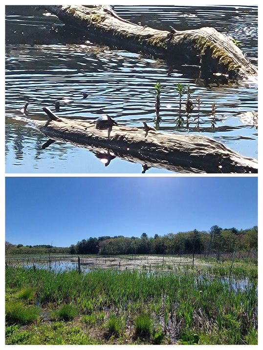
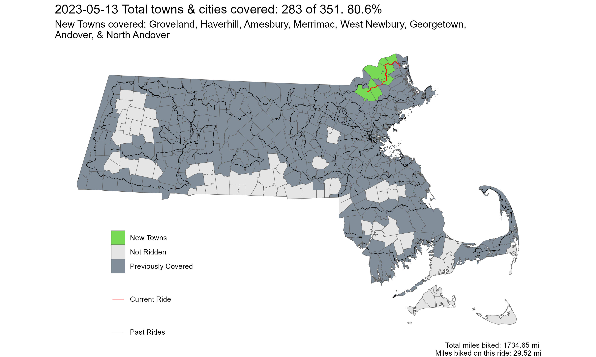

[**Youtube Link**](https://youtu.be/3acgV_ni3UE?feature=shared)

[**Ride With GPS Link**](https://ridewithgps.com/routes/42607182)

It was the perfect May day with clear sunny skies and crisp cool-warm temperatures. Leaves were still fresh green, and overall the perfect Boston spring day. My ride started from the Andover Commuter Rail Station and passed through Andover town center, and the infamous Elm Square intersection, where just three days earlier, [a child was fatally struck by the driver of a tractor-trailer](https://mass.streetsblog.org/2023/05/15/truck-driver-kills-5-year-old-girl-in-downtown-andover-crosswalk). The intersection has [long been considered dangerous](https://mass.streetsblog.org/2023/06/08/andover-town-officials-ignored-residents-warnings-about-hazards-at-site-of-fatal-crash), but town officials have [only now started](https://mass.streetsblog.org/2023/08/28/andover-select-board-formally-adopts-vision-zero) taking it seriously - a reminder of how fatalities are often required to wake up authorities.

From Andover up until the Rocks Village Bridge, the ride was relatively chill, and nothing exciting to report on **EXCEPT ONE THING - SNAKES**. About 2 miles north of Georgetown town center, I had originally planned on going through the Crane Pond Wildlife Management Area to avoid a climb along a relatively high-traffic road. There is a big sign at the entrance saying 'Road Closed' - which I obviously ignored, as one does while on a bike. Additionally, there was Google Streetview imagery, so I thought it might be ok. Unfortunately, the road had some ponding, which I thought I could just lightly get through. **A BIG NOPE**. The moment I put my foot on a slightly rotted out plank of wood, I saw 5-6 snakes rush away from my foot! Based on what I could make out, it was very dark to black in color, so could be [one of the four listed here](https://www.mass.gov/info-details/snakes-of-massachusetts#:~:text=about%20each%20snake.-,Snake%20species,-Common%20gartersnake). Thus, unfortunately, I had to turn around and take the other route.

After crossing at Rock Village in Haverhill, the route was mostly along the Merrimac River, which, in the mid-spring sun was a brilliant blue color. The ride ended in Newburyport. I did not have enough time before my train, but one of the nicest seafood pastas I've had was at [Micheal's Harborside](https://goo.gl/maps/b6ebRq5FBC91DkAMA), in Newburyport.

 
*Main Street near Ipswich Road, in Boxford*

 
*River Road, near the town-line of Merrimac and Haverhill*

 
*Wildlife in the Crane Pond Wildlife Management Area. Turtles and (not pictured, but 100% DEFINITELY there) snakes!*

 
*Strava Route - Mad Merrimac Meander*

Overall, I covered 8 new towns - Groveland, Haverhill, Amesbury, Merrimac, West Newbury, Georgetown, Andover, and North Andover - bringing the total to 283/351 - 80.6%!

