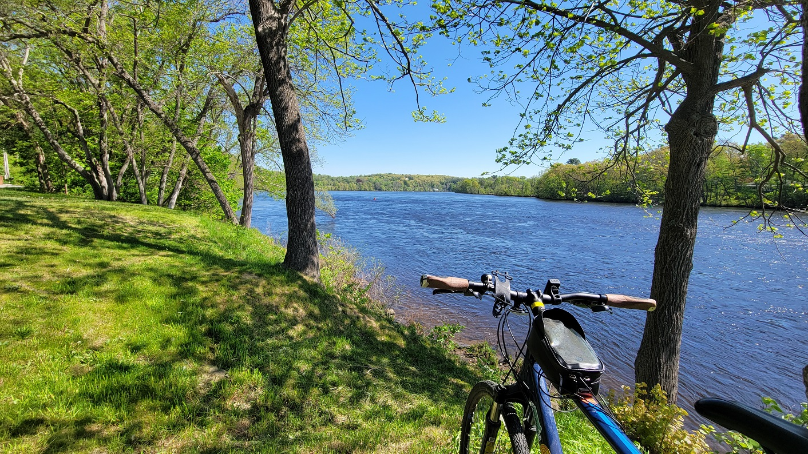
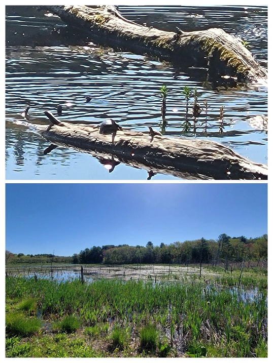
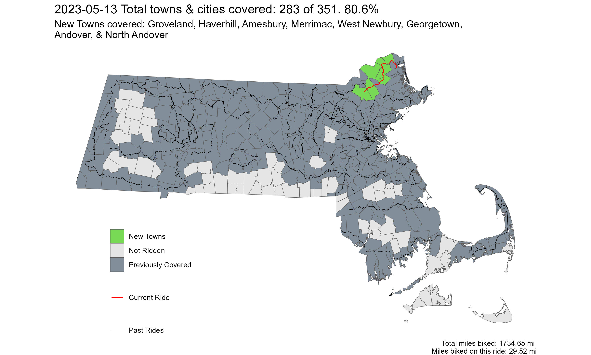

[**Youtube Link**](https://youtu.be/3acgV_ni3UE?feature=shared)

[**Ride With GPS Link**](https://ridewithgps.com/routes/42607182)

It was the perfect May day with clear sunny skies and crisp cool-warm temperatures. Leaves were still fresh green, and overall the perfect Boston spring day. My ride started from the Andover Commuter Rail Station and passed through Andover town center, and the infamous Elm Square intersection, where just three days earlier, [a child was fatally struck by the driver of a tractor-trailer](https://mass.streetsblog.org/2023/05/15/truck-driver-kills-5-year-old-girl-in-downtown-andover-crosswalk). The intersection has [long been considered dangerous](https://mass.streetsblog.org/2023/06/08/andover-town-officials-ignored-residents-warnings-about-hazards-at-site-of-fatal-crash), but town officials have [only now started](https://mass.streetsblog.org/2023/08/28/andover-select-board-formally-adopts-vision-zero) taking it seriously - a reminder of how fatalities are often required to wake up authorities.

 
*Main Street near Ipswich Road, in Boxford*

 
*River Road, near the town-line of Merrimac and Haverhill*

 
*Wildlife in the Crane Pond Wildlife Management Area. Turtles and (not pictured, but 100% DEFINITELY there) snakes!*

 
*Strava Route - Mad Merrimac Meander*

Overall, I covered 8 new towns - Groveland, Haverhill, Amesbury, Merrimac, West Newbury, Georgetown, Andover, and North Andover - bringing the total to 283/351 - 80.6%!

