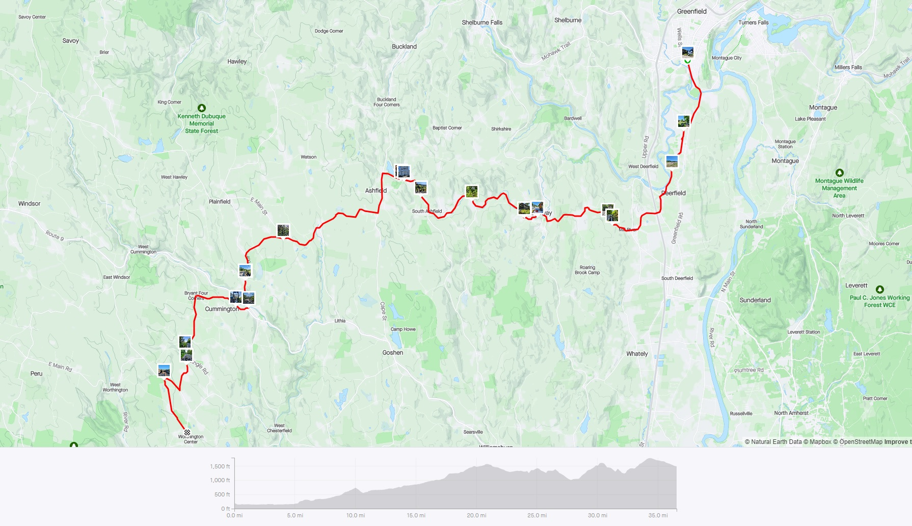

**Ride With GPS Links**:

[Day 1 - Greenfield to Worthington](https://ridewithgps.com/routes/42785718)

[Day 2 - Worthington to North Adams](https://ridewithgps.com/routes/42815679)

The northern Berkshire Hills area, followed by the northern half of the Pioneer Valley is probably my favorite place to ride in all of Massachusetts. There are enough low- to no-stress roads here that aren't as isolating as rail-trails. Despite the steep hilly roads, it is really peaceful to ride here, and I have only had positive experiences with. I have started/ended countless rides in Greenfield and Northampton - both very nice towns to spend time in.

One of my most favorite rides - [**the towns north of Route 2**](https://ride351ma.bike/post/2022-08-21-rural-ridin/) - was also the most hilly ride I've ever done in Massachusetts.

### Day 1 - Greenfield to Worthington

For this ride, I started by taking the Amtrak Vermonter train from Essex Junction VT to Greenfield MA. I was accompanying the [*2023 Bostreal*](https://bostoncyclistsunion.org/bostreal) group as a support volunteer. I had previously ridden with them during the [2021 ride](https://ride351ma.bike/post/2022-04-23-bostreal-day-1/). As mentioned in the [*Trip Planning*](https://ride351ma.bike/post/2023-12-31-trip-planning/#transportation-to-and-from-the-ride) guide, Amtrak allows bicycles on this train with pre-booking.

 
*Essex Junction VT (left), and Greenfield MA (right)*

The Vermonter train goes along the Connecticut River, and has some incredible views. I've taken it once in fall, and the views were incredible. You can catch a glimpse of the Cornish-Windsor covered bridge, which is the second-longest covered bridge in the US (used to be the longest).

 
*The Cornish-Windsor Covered Bridge*

The ride today consisted of a nearly 1,500 foot climb, nearly consistently uphill for 15 miles, after an initial 5 miles in the flat northern Pioneer Valley through Deerfield. I had previously only skirted the southern portion of Deerfield on the [Mohawk Trail](https://ride351ma.bike/post/2022-04-23-the-mohawk-trail/) ride, and twice along the northern edge after crossing over from Montague on the Canalside Rail Trail Bridge (See [Connecticut River Connect](https://ride351ma.bike/post/2022-10-15-connecticut-river-connect/) and [A Wedding with a side of Covid](https://ride351ma.bike/post/2022-05-29-a-wedding/)). This time, however, I rode right through the main part of the historic town. Unfortunately I do not have good pictures, but it was a picturesque farming town with a nice shaded main street. While the road wasn't a narrow rural road, it had very few vehicles - a feature of the northern Berkshire Hills and Pioneer Valley I love.

##### Conway

I have passed through the town of Conway, and had a snack/water break at the Conway General Store three times so far. It has become my favorite place to stop. It is a very basic, simple general store with the basics, but they have a small bike rack with some space to sit and eat. This time, however, was the first time I was going beyond Conway along Route 116N, and not to or from Shelburne Falls. I also came across a small covered bridge right after the store. Conway remains a favorite town to pass through.

*Conway General Store, and a Covered Bridge*

##### Routes 116 and 112

Massachusetts State routes 116 and 112 are two very beautiful bike routes - and also drives for persons of the automobile persuasion. They go through unmatched scenery with forests, hills, valleys, and fields - winding their way through small towns such as Conway, Ashfield, Plainfield. Coupled with the early summer sun, it was a sight to behold.

*Route 112 in Cummington, MA*

I spent the night at the [Goldenrod Country Inn](https://www.goldenrodcountryinn.com/), in Worthington, and had dinner at [Liston's Restaurant and Bar](https://listonsbar.com/). I highly recommend staying at the Goldenrod Inn. The room was moderately priced, and was impeccably attended to. Because of the almost constant climb, it was a very exhausting day, however, as it is with the Berkshire hills, it was worth every drop of sweat!

*Goldenrod Country Inn, Worthington MA*

### Day 2 - Worthington to North Adams

While yesterday was mostly uphill, today was going to have a nice long downhill portion descending into the Berkshire Valley. Today was a day of surprises - all nice!

The first time I rode to the Berkshire Valley, I rode down Route 2 from Florida into North Adams. That super steep descent was after a super steep ascent, and my legs, and parched body was in shambles. This time, thankfully, I had plenty of spots to get refreshments, with one surprising stop in Windsor MA!

Today was a hot day, and compared to yesterday, a larger portion of my route went through unshaded portions. So hydration was key. While there was more downhill and flat portions, the heat made things much more difficult. The recent black-topping of Route 8A did not help with the heat either!

My first town after leaving Worthington was the aptly named Peru! Peru is high up in the Berkshire hills, and is thickly forested. I even saw a bear cub on the road leading into town! It has a small library with peeling paint, and no commercial establishments.

*Peru town sign on Rt 143. I saw a bear cub right after this sign in the distance!*

*Two important buildings in the town of Peru - the town offices, and library*

The next 14 miles were mostly uneventful and relatively flat (after a short descent). I think it would have been more enjoyable if the weather had been good. After a brutal, hot climb along the freshly tarred (and insanely hot) Route 8A, I made my way to my final refreshment stop of the ride - the Sangar General Store, in Windsor MA.

It was a surprise to find samosas in the middle of a tiny hilltown in the Berkshires. Turns out, its kind of well-known-(ish), and there's even a small [radio interview](https://beta.prx.org/stories/260926) of the owner - Prem Sangar. Windsor was at the high-point before my final descent into the Berkshire Valley, so I spent a little while recharging.

*Samosas, Gatorade, and Coconut water at the Sangar General Store*

*Windsor Congregation Hall, and the Sangar General Store*

##### Berkshire Valley

After descending down from Windsor, I had a small uphill portion through some farmland. It was a very stunning view, with large fields, barns, grain silos, and Mt Greylock in the background. It was also a relatively less trafficked road, so I could enjoy the views safely.

*Fields and the background hills along Bucklin Road*

*Farm buildings and Mt Greylock in the background*

##### North Adams

Thoroughly exhausted from my ride, I finally made it to my Airbnb in North Adams. I had a cold water shower before heading out for dinner at the MassMOCA campus. There was a small brewery with a brisket place. MassMOCA is located in an old mill building, and in the evening light, it looked beautiful.

*The MassMOCA building*

### Day 3 - North Adams to Williamstown

I had a bus to catch back to Boston on my third day. Also, I had already ridden through Williamstown, and it being a relativly small ride, I did not really do much planning. I had some hours before my bus, so I decided to spend a day at the Clark Art Institute. While the Clark Art Institute is quite old, their new building and newer structures on campus are designed by the reknowned architect from Japan - Tadao Ando, and thus I had to check out not just the art on display, but also the building.

Tadao Ando is a master of concrete, and his skills are on full display at the Clark. It is also home to some great pieces of art.

*Exterior of the main pool area of the Clark Institute, by Tadao Ando*

*Benches by the pool, and an exterior stairway in a courtyard, by Tadao Ando*

*'Little Dancer' - sculpture by Degas (left), and 'Woman with a Fan' - painting by Renoir (right), at the Clark Institute*

Dark grey clouds had started to gather, as I waited for the bus back to Boston, and I was worried about the shelter-less bus stop. Thankfully, the bus just showed up as the first drops started falling, and before it got too bad, I was safely inside, on my way home after an epic Berkshire adventure.

 
*Strava Route Day 1 - Greenfield to Worthington*

 
*Strava Route Day 2 - Worthington to North Adams*

Overall, I covered 11 new towns - Cheshire, Worthington, Cummington, Peru, Plainfield, Dalton, Windsor, Hinsdale, Savoy, Adams, and Washington - bringing the total to 296/351 - 84.3%!

