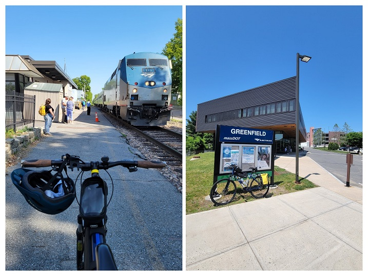

**Ride With GPS Links**:

[Day 1 - Greenfield to Worthington](https://ridewithgps.com/routes/42785718)

[Day 2 - Worthington to North Adams](https://ridewithgps.com/routes/42815679)

The northern Berkshire Hills area, followed by the northern half of the Pioneer Valley is probably my favorite place to ride in all of Massachusetts. There are enough low- to no-stress roads here that aren't as isolating as rail-trails. Despite the steep hilly roads, it is really peaceful to ride here, and I have only had positive experiences with. I have started/ended countless rides in Greenfield and Northampton - both very nice towns to spend time in.

One of my most favorite rides - [**the towns north of Route 2**](https://ride351ma.bike/post/2022-08-21-rural-ridin/) - was also the most hilly ride I've ever done in Massachusetts.

### Day 1 - Greenfield to Worthington

For this ride, I started by taking the Amtrak Vermonter train from Essex Junction VT to Greenfield MA. I was accompanying the [*2023 Bostreal*](https://bostoncyclistsunion.org/bostreal) group as a support volunteer. I had previously ridden with them during the [2021 ride](https://ride351ma.bike/post/2022-04-23-bostreal-day-1/). As mentioned in the [*Trip Planning*](https://ride351ma.bike/post/2023-12-31-trip-planning/#transportation-to-and-from-the-ride) guide, Amtrak allows bicycles on this train with pre-booking.

 
*Essex Junction VT (left), and Greenfield MA (right)*

The Vermonter train goes along the Connecticut River, and has some incredible views. I've taken it once in fall, and the views were incredible. You can catch a glimpse of the Cornish-Windsor covered bridge, which is the second-longest covered bridge in the US (used to be the longest).

 
*The Cornish-Windsor Covered Bridge*

 
*Wildlife in the Crane Pond Wildlife Management Area. Turtles and (not pictured, but 100% DEFINITELY there) snakes!*

 
*Strava Route Day 1 - Greenfield to Worthington*

 
*Strava Route Day 2 - Worthington to North Adams*

Overall, I covered 11 new towns - Cheshire, Worthington, Cummington, Peru, Plainfield, Dalton, Windsor, Hinsdale, Savoy, Adams, and Washington - bringing the total to 296/351 - 84.3%!

