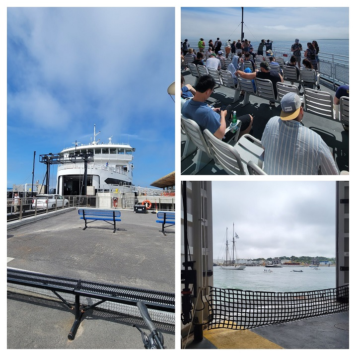
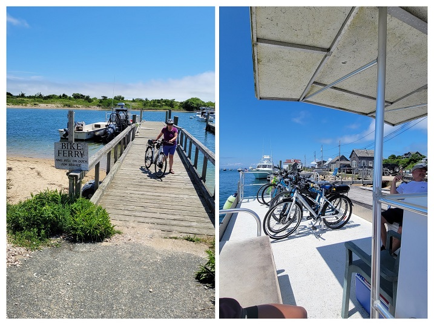
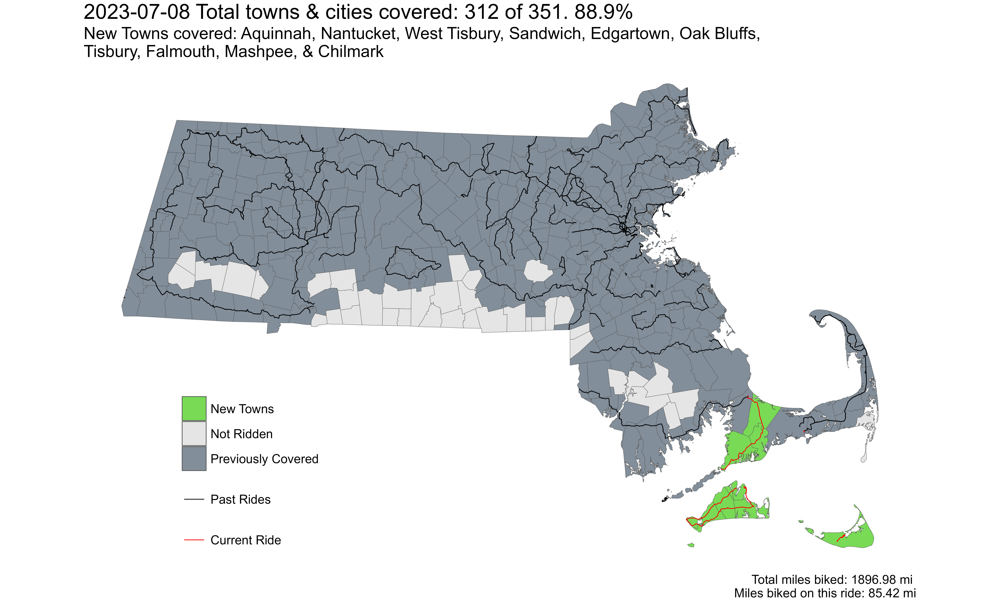

[**Youtube Link**](https://youtu.be/QkJWLEODoVQ?feature=shared)

**Ride With GPS Link**

* [Bourne to Woods Hole](https://ridewithgps.com/routes/43389712)
* [Martha's Vineyard: Vineyard Haven to HI Hostel](https://ridewithgps.com/routes/43390920)
* [Martha's Vineyard: HI Hostel to Oak Bluffs](https://ridewithgps.com/routes/43392473)
* [Nantucket Loop](https://ridewithgps.com/routes/43392840)

This was a long awaited trip - in the nearly five years of living in Boston, I had never been to the islands. The first island I went to was [Cuttyhunk](https://ride351ma.bike/post/2022-05-23-south-coast-ing/) in May 2022! Even though I've ridden my bike on the Cape multiple times, I have always had a very bad experience riding in the Upper and Mid Cape. This is definitely anecdotal, but the most hostility I've faced in Massachusetts (and the only hostility that really affected me) was on the Cape. The Outer Cape is fine though, and I've only had friendly experiences.

We started our journey by taking an early morning [P&B Bus](https://www.p-b.com/schedules/) from Boston South Station to the [Sagamore Park & Ride](https://goo.gl/maps/38CzzmXaiYkChSkFA). From here, we rode down to Wood's Hole to catch our ferry to Martha's Vineyard. This ride was relatively uneventful - this part of the Cape is not unlike the suburban areas of Boston. Until we hit the Shining Seas bike path in Falmouth, it was mostly narrow, but heavily trafficked roads. The weather was very high humidity, so we were drenched by the time we got to the Wood's Hole Ferry Terminal.

##### Upper Cape

Shining Seas bike path was nice, if crowded. It went right by the coast - and would have felt brilliant if it was sunny and cool. However, the cloudy and slightly foggy weather had its charm too.

*Shining Seas Bike Path, Falmouth MA*

*Wood's Hole to Martha's Vineyard Ferry, at the terminal, on the deck, and below where our bikes were*

##### Martha's Vineyard

First impressions of Vineyard Haven were, not the best. Along with the Cape, I feel it is suffering from over-tourism. A remnant of the 1960s era of tourism. Its narrow roads with a lack of decent active or public transportation options makes getting around without a car, not ideal.

However, after a less-than-awesome bike ride, we made our way to the fishing village of Meneshma. Meneshma was really nice. We got chatting with an old man who grew up in Meneshma, and after living elsewhere, has moved back. We also got a nice fish sandwich. I 100% recommend visiting Meneshma. To go from Meneshma to Aquinnah, there is a [bike ferry](https://www.facebook.com/MenemshaBikeFerry/) in the summer. It is operated by a local guy, and costs justs $5 to cross.

*Meneshma fishing village lagoon*

*Meneshma bike ferry connecting to Aquinnah*

After crossing over from Meneshma, the route was much nicer. Actually, it had already become much nicer after turning off the main road towards Meneshma. We made our way towards the Aquinnah Cliffs Overlook. This is a very important cultural site for the Wampanoag people, and there is a very good informative exhibit at this point. The views of the cliffs are also very impressive. We were lucky to see some dense fog roll in. The effect of the fog and the sun together was awesome.

*Aquinnah Cliffs*

After the Aquinnah Cliffs overlook, we were very tired. That night, we were staying at the [Hostelling International Hostel](https://www.hiusa.org/find-hostels/massachusetts/west-tisbury-525-edgartown-w-tisbury-road) in West Tisbury. It is the ~~only affordable accommodation~~ least expensive accommodation on the island. Yes. Martha's Vineyard is expensive to stay - even at a hostel. Nantucket you ask? Forget about it.

 
*Entire Strava Route - also includes ferry rides*

Overall, I covered 10 new towns - Aquinnah, Nantucket, West Tisbury, Sandwich, Edgartown, Oak Bluffs, Tisbury, Falmouth, Mashpee, and Chilmark - bringing the total to 312/351 - 88.9%!

