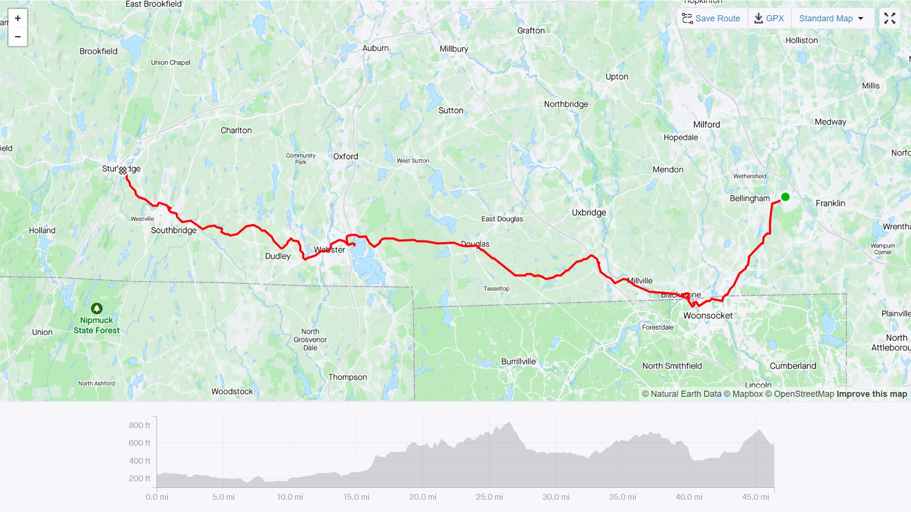
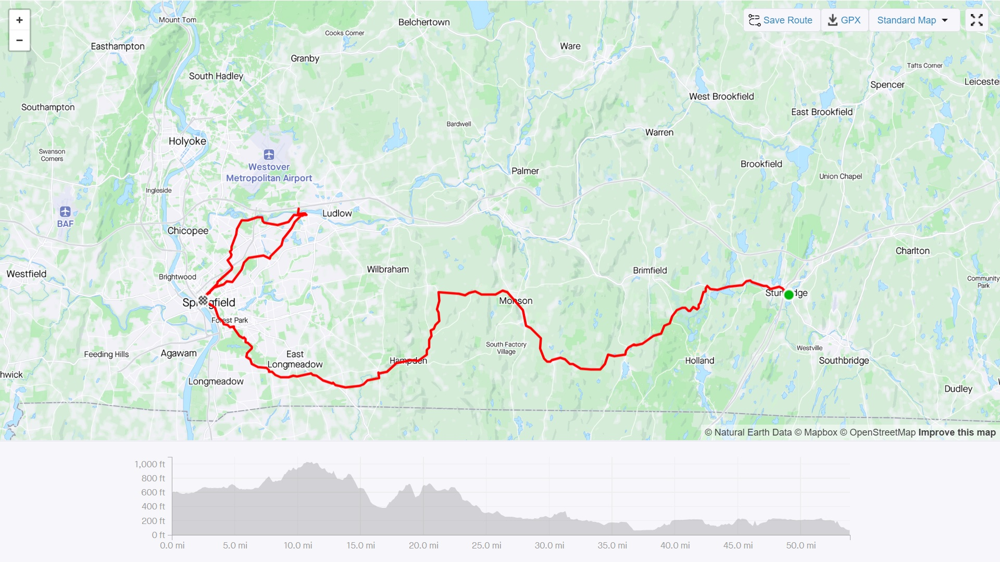
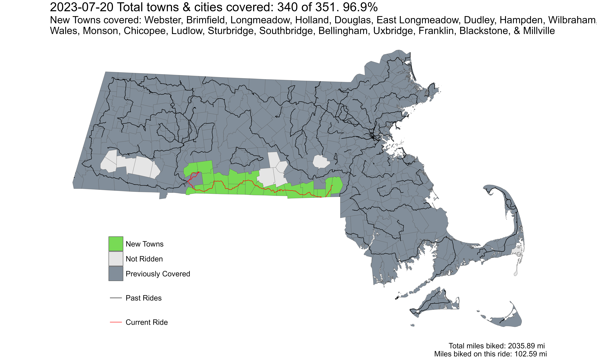

**Ride With GPS Link**

* [Day 1: Franklin to Sturbridge](https://ridewithgps.com/routes/42658463)
* [Day 2: Sturbridge to Springfield](https://ridewithgps.com/routes/42664054)
* [Chicopee-Ludlow Loop](https://ridewithgps.com/routes/43477246)

 
*Strava Route Day 1 - Franklin to Sturbridge*

 
*Strava Route Day 2 - Sturbridge to Springfield, and the Ludlow-Chicopee loop*

Overall, I covered 20 new towns - Webster, Brimfield, Longmeadow, East Longmeadow, Holland, Douglas, Dudley, Hampden, Wilbraham, Wales, Monson, Chicopee, Ludlow, Sturbridge, Southbridge, Bellingham, Uxbridge, Franklin, Blackstone, and Millville - bringing the total to 340/351 - 96.9%!

