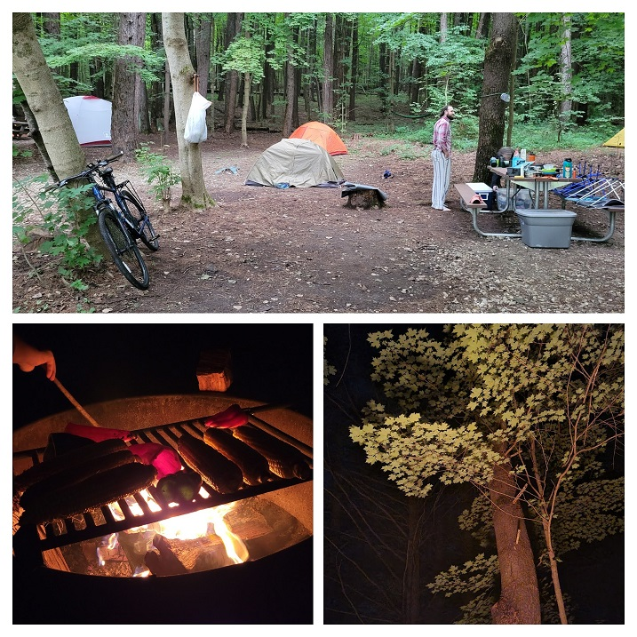
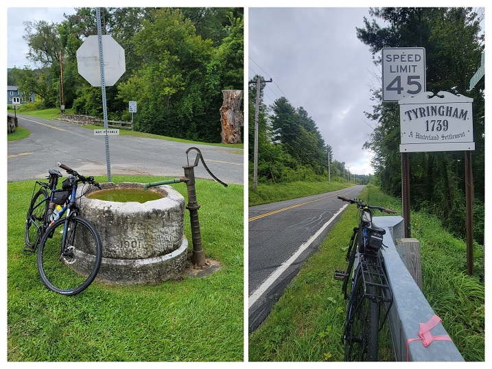
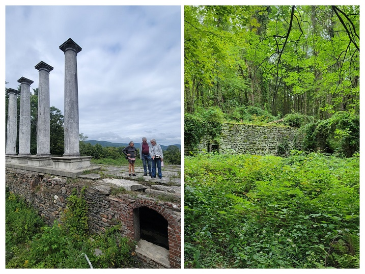
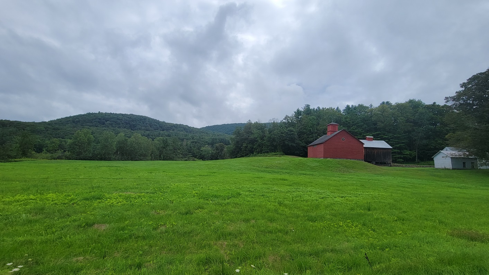
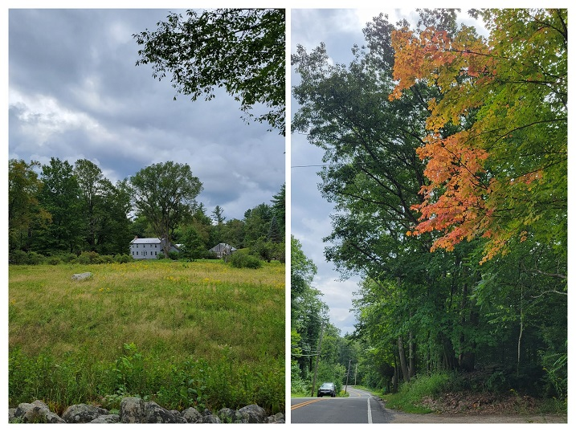
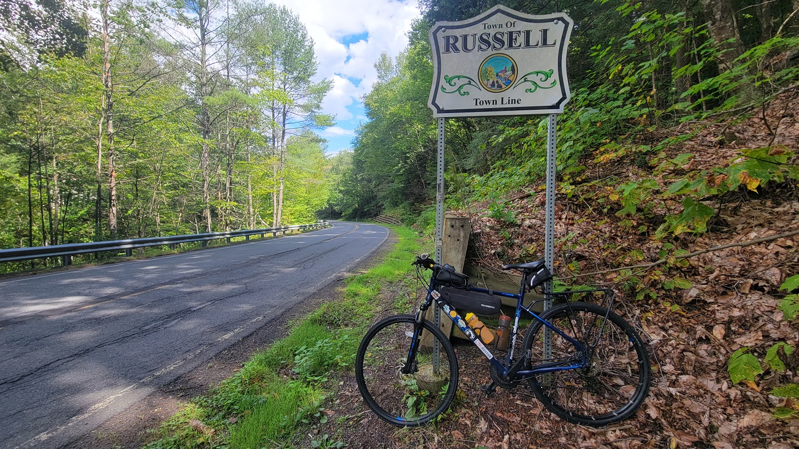
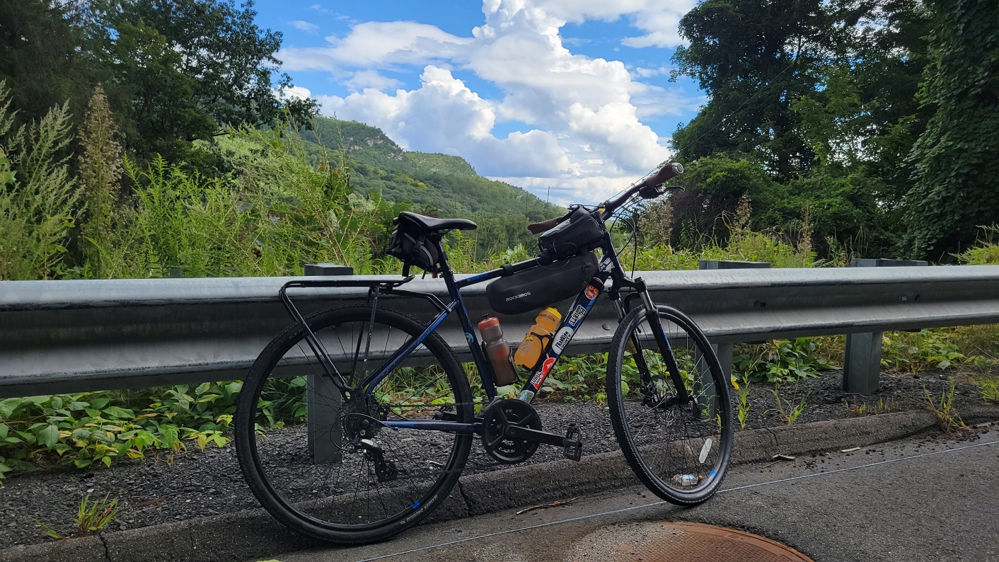
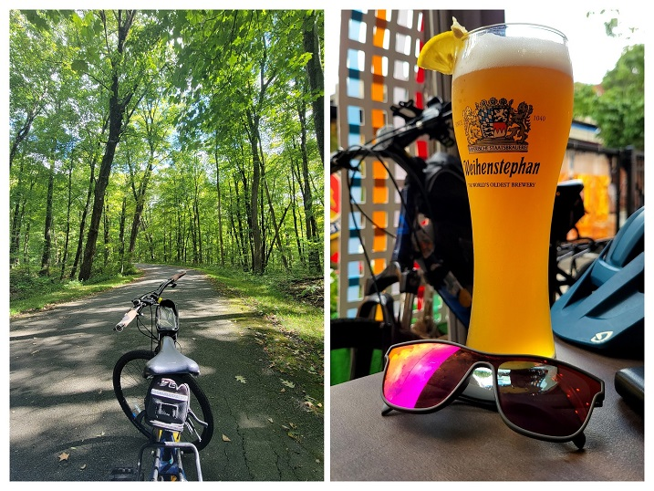
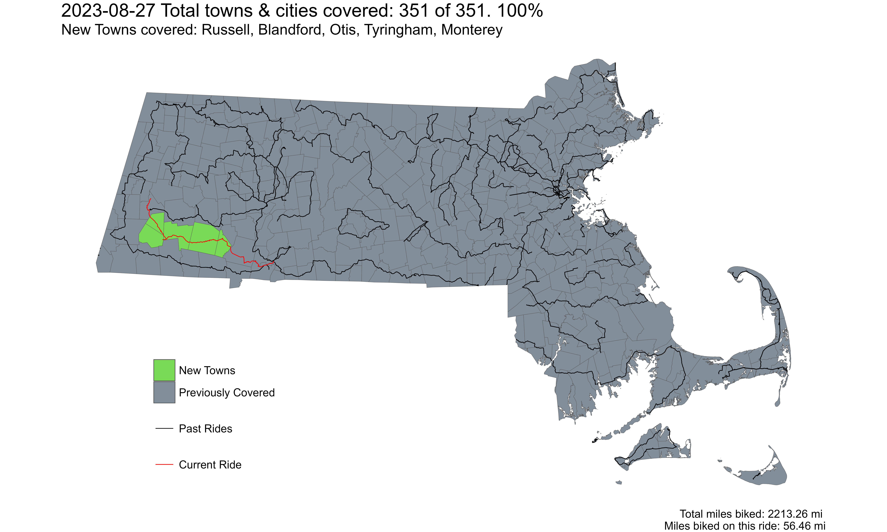

[**Ride With GPS Link**](https://ridewithgps.com/routes/38842095)

This route (or slight variations thereof) had been part of the original 'plan' where I had mapped out multiple routes at the beginning of this challenge connecting points in the Berkshire (Pittsfield, Lee, Lenox, Williamstown) and Pioneer (Greenfield, Northampton, Springfield) Valleys which are transit hubs. However, I never really made it out here until now - when these towns were the last five left on the challenge.

According to the original plan, my spouse and I were going to join our friends camping in October Mountain by taking the Peterpan bus from Boston. Thanks to a red line delay, we missed the only bus that goes to Lee/Lenox! Some fast thinking about next steps, and a huge sacrifice by my spouse to not bike led us to rent a car - whereby she would drive back instead of biking with me.

We got to October Mountain and had a great time with our friends with some camp-khichadi being our contribution to group meals. In addition to camp-khichadi, we also had roasted corn, poblano peppers, eggplant, and foraged lions mane mushroom!

*October Mountain State Forest Camping*

For an approximately 55 mile ride in hilly terrain (but also with a long descent towards the end), I had [estimated 7 hours](https://ride351ma.bike/post/2023-12-31-trip-planning/#route-planning:~:text=as%20well.-,DISTANCES%20%26%20HOURS,-This%20will%20be) for this ride. With the 5:45pm direct Springfield-Boston bus in mind, I decided to leave camp at 9:00am to leave a little gap for some food in Springfield before the bus.

The first town where I hadn't ridden through yet was Tyringham. Although I had to ride through Lee, I had already done so in a previous ride. Tyringham center had this nice old (now unused) marble well.

*Well in the center of Tyringham town*

I rode along Main Road in Tyringham, up until West Otis, where I did a 'stub-town-ride' for Monterey - another town I will need to ride through later. This Main Road had a couple of attractions where I had planned to stopped and take pictures - Santarella Gardens, and Ashintully Gardens. Santarella was interesting in that it looks like a fairytale thatched roof cottage. However, it was a bit underwhelming, so I didn't stop - others might have a different take. Ashintully Gardens on the other hand felt interesting - although not really up to the hype I had heard. Initially I had thought that the columns on the hill were just some folly (see '[**architectural folly**](https://en.wikipedia.org/wiki/Folly)'), but turns out it really was a mansion of some local rich guy which had fallen into disrepair over the decades after a fire in 1952.

*Ruins of the Tytus Mansion at Ashintully Gardens*

Riding through Tyringham was beautiful - I passed by streams, farms, and nice hillside roads that weren't too bad climbs - until they weren't. Right after Ashintully Gardens, there was a long steep climb into Otis.

*A farm in Tyringham with red farmyard buildings*

From Otis, going eastward on St Rt 23 was easy enough until the second super long and steep climb just before Blandford. Traffic was thankfully not the worst (relatively as can be for a rural hilly area, albeit near a large city like Springfield). I saw the first signs of fall just after Otis too!

*A field with a house in the back, and brilliantly colored tree, ready for fall*

After summitting Blandford Center, I had a long steep descent into Westfield - with the last town - Russell somewhat midway downhill! I was excited for this. Also, getting this long downhill after two excruciating climbs was pure bliss.

**And then I did it. I finally completed the challenge! It is always a good feeling to finish what you start - but when it is a challenge you set for yourself, outside of any academic or professional goals - it is always harder. This is an achievement that I will always be proud of.**

*My bike at the Russell town line with Blandford on Russell/Blandford Stage Road*

While my challenge ended after crossing the Russell town line, I still had 25 more miles left before getting to Springfield and my bus back home! After doing a loop through Russell town center, and calling my family to share the news, I set off along Rt 20 where I was able to capture a nice image of cliffs - a landform you don't really see in the Berkshires.

*Cliffs in the Berkshire Hills*

My ride through Agawam and West Springfield consisted of two highly contrasting roadscapes. Just after entering Agawam, I was able to ride through the Robinson State Park, which is along the Westfield River. While there were some short sharp hills, there were no cars on the paved road, so it was much more pleasant than the main road alternative. The worst portion of this route was along Memorial Ave in West Springfield - where even experienced bikers (I consider myself one) could feel terrified. Thankfully it seems like the extension of the bike path from Agawam is happening soon along this road through till Springfield.

I finally ended my ride again, at the Student Prince Cafe and the Fort for some reward beer and fried Camembert cheese!

*My bike on a path in the Robinson State Park, Agawam, and a tall beer at the Student Prince German restaurant in Springfield*

It was a fun, exciting, leg-breaking, and also expensive(!) ride around the Commonwealth. I have loved living here, and hope to continue to do so for a long time.

 
*Strava Route - Final Jaunt*

Overall, I covered 5 new towns - Russell, Blandford, Otis, Tyringham, and Monterey - bringing the total to 351/351 - 100.0%!

