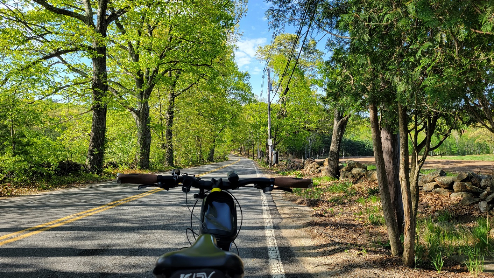

[**Ride With GPS Link**](https://ridewithgps.com/routes/38842095)

This route (or slight variations thereof) had been part of the original 'plan' where I had mapped out multiple routes at the beginning of this challenge connecting points in the Berkshire (Pittsfield, Lee, Lenox, Williamstown) and Pioneer (Greenfield, Northampton, Springfield) Valleys which are transit hubs. However, I never really made it out here until now - when these towns were the last five left on the challenge.

 
*Main Street near Ipswich Road, in Boxford*

 
*River Road, near the town-line of Merrimac and Haverhill*

 
*Wildlife in the Crane Pond Wildlife Management Area. Turtles and (not pictured, but 100% DEFINITELY there) snakes!*

 
*Strava Route - Final Jaunt*

Overall, I covered 5 new towns - Russell, Blandford, Otis, Tyringham, and Monterey - bringing the total to 351/351 - 100.0%!

