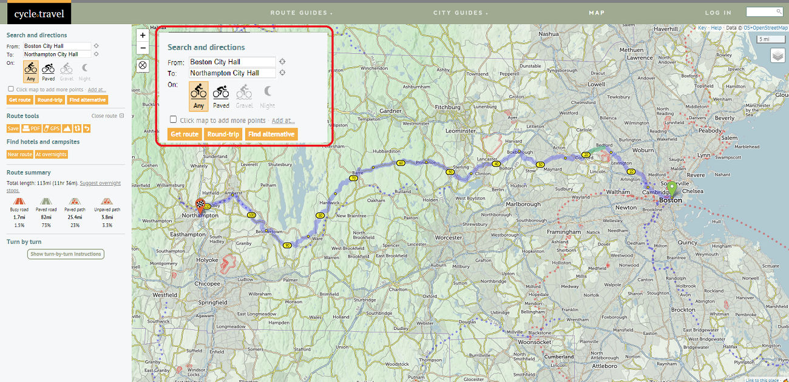

I first started getting into planning my bike rides beyond just - "Enter start and end points on Google Maps and GO!" after my [Bos/treal (check it out!!)](https://bostoncyclistsunion.org/bostreal) ride in 2021. Since then, I've gathered a list of resources which I have used, and some I haven't, but come recommended! **Note: None of the links are sponsored. I do not get any commission if you click on these links.**

To give an overview, the following points are a good gist of what to think of when trip planning. I have detailed each section further down as well. I am always happy to answer any questions you may have, and offer help, advice, and suggestions **AT ABSOLUTELY NO MONETARY COST**. I was the recipient of all of this information because of generous help from others, and I wish that you get it at no cost as well!

-   Route Planning:
    -   Tools and Applications
    -   Distances & Hours
    -   Terrain
    -   Rest stops
-   Overnight Stops:
    -   Accommodation types
    -   Where to find them
-   Transportation to/from the ride:
    -   Rail & Bus
    -   Car
-   Gear & Packing List:
    -   Tools
    -   Navigation
    -   Refreshments
    -   Clothing
    -   Personal effects
-   Storage
-   Bike Transportation

## Route Planning:

A lot of thought goes into route planning. This is, after all the main component of the trip! I use multiple free and paid websites and tools to plan a route as thoroughly as possible. A few things I take note of are terrain & road conditions, rest stop locations, points of interest along the way, and sometimes when transportation options are limited, time to & from transportation points. We'll go through all of these.

### Websites and Applications

My route planning arsenal consists of two primary websites: 

* [RidewithGPS](https://ridewithgps.com/)
* [Google Maps](https://www.google.com/maps/)

I also use a website called [cycle.travel](https://cycle.travel/) sometimes. It is just like Google Maps, but directs you along bike friendly routes. I have found their routing suggestions to be better than Google Maps. However, currently their service is only available in the usual suspects - Europe, North America and Australia-New Zealand. Here, I will discuss only how to use RidewithGPS and Google Maps in tandem, and give a brief overview of Cycle.Travel at the end.

#### Step 1 - Decide your start and end stops. 

This may be affected by your accommodation and transportation choices. Check out those sections for more information on how to plan for those. All these elements are, of course, dependent on each other, and may keep dynamically evolving depending on availability and scheduling restrictions. Let's use an example for our planning. Note that certain elements of RidewithGPS require a paid subscription. They offer multiple levels of subscriptions, so I'd recommend looking into what's important for you before purchasing anything.

#### cycle.travel

While cycle.travel is unfortunately geographically limited, for those planning rides in these areas (Europe, North America - excl. Mexico, and Australia-NZ) it is an excellent complementary tool for the above steps. For the following example, let's look at a bike route from Boston City Hall to Northampton City Hall.

In the initial welcome screen, you can add the start and end points (which can of course be edited later in the planner).

*Initial Route Plan - fill in the From and To sections, and select what kind of surface suggestions you want*

In the left panel, in **'Route Summary'** you can also split the route into multi-day sections. This option comes when the distance of your ride goes beyond 30 miles. You can see the small moon sign indicating overnight stop location. These are of course only suggested locations, and you can move them to a more convenient location in the planner map. Additionally, you can also click on **'Find Hotels and Campsites'** for suggestions on accommodations.

*Overnight Stop Suggestions - It needs a minimum trip distance of 30 miles.*

#### Other Apps:

### Distances & Hours

### Terrain

### Rest stops

## Overnight Stops:

###Accommodation types

### Where to find them

## Transportation to/from the ride:

### Rail & Bus

### Car

## Gear & Packing List:

### Tools

### Navigation

### Refreshments

### Clothing

### Personal effects

## Storage

## Bike Transportation
