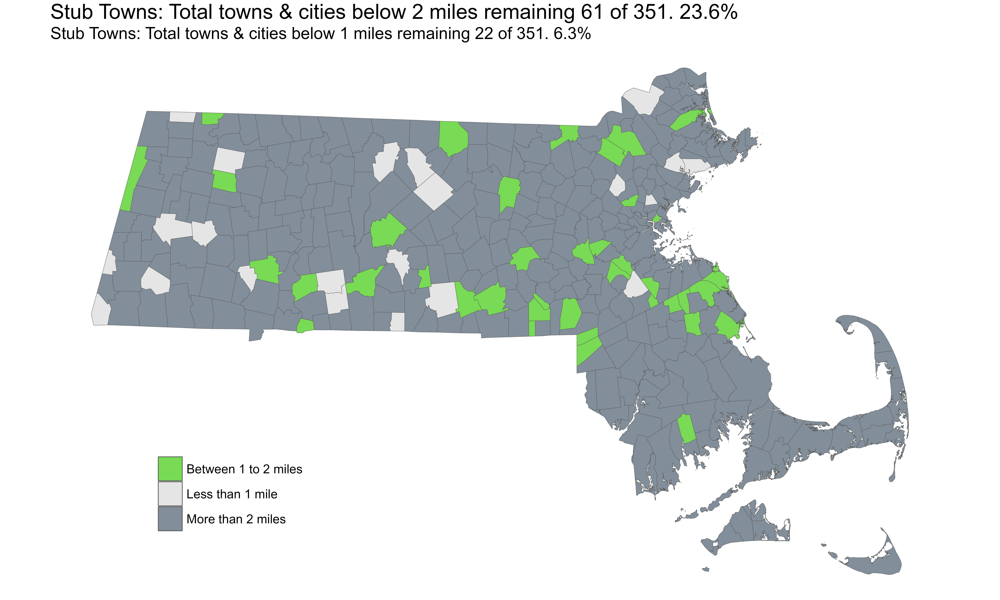

After completing the 351 challenge in August, I decided to rest on my laurels, because I needed to. A win after a long time, this was something I wanted to celebrate. A small caveat, however, was that I had 'finished' some towns in a somewhat incomplete way. I call these 'stub' towns. These were towns where, because of the various combination of routes I chose, they weren't really on the way. I would have had to take a very long detour to include them. Or, because of the nature of availability of public transport (or rather, lack thereof), including these towns in reasonable lengthed bike rides was difficult.

So how did I incorporate them in a ride? I would take a slight detour and just cross the border enough to 'ride through' that town. As such, as of August, there were 663 towns where I rode less than 2 miles, and 24 towns where I rode less than 1 mile. My goal for the 2024 riding season is to cover as many of these as I can. **For these rides, I am going to consider renting a car**.

| muni_id|muni_name          | miles|latest_ride |status               |
|-------:|:------------------|-----:|:-----------|:--------------------|
|     194|Montgomery         |  0.15|2022-06-20  |Less than 1 mile     |
|      63|Clarksburg         |  0.19|2022-03-18  |Less than 1 mile     |
|      50|Canton             |  0.20|2022-03-18  |Less than 1 mile     |
|      30|Beverly            |  0.26|2023-02-10  |Less than 1 mile     |
|     183|Middlefield        |  0.27|2022-06-20  |Less than 1 mile     |
|     128|Haverhill          |  0.29|2023-05-13  |Less than 1 mile     |
|      71|Danvers            |  0.30|2023-02-10  |Less than 1 mile     |
|     129|Hawley             |  0.30|2022-08-21  |Less than 1 mile     |
|       6|Alford             |  0.33|2022-09-11  |Less than 1 mile     |
|      54|Charlton           |  0.33|2023-08-14  |Less than 1 mile     |
|     313|Washington         |  0.41|2023-06-02  |Less than 1 mile     |
|     193|Monterey           |  0.46|2023-08-28  |Less than 1 mile     |
|     161|Ludlow             |  0.47|2023-07-20  |Less than 1 mile     |
|     323|West Brookfield    |  0.55|2022-11-05  |Less than 1 mile     |
|     294|Templeton          |  0.64|2022-03-18  |Less than 1 mile     |
|     339|Wilbraham          |  0.79|2023-07-20  |Less than 1 mile     |
|     195|Mount Washington   |  0.82|2022-09-11  |Less than 1 mile     |
|      15|Athol              |  0.85|2022-03-18  |Less than 1 mile     |
|      48|Burlington         |  0.85|2022-05-14  |Less than 1 mile     |
|     140|Hubbardston        |  0.87|2022-05-29  |Less than 1 mile     |
|     178|Melrose            |  0.88|2022-03-18  |Less than 1 mile     |
|     135|Holland            |  0.98|2023-07-20  |Less than 1 mile     |
|       3|Acushnet           |  1.04|2023-07-15  |Between 1 to 2 miles |
|      57|Chelsea            |  1.06|2022-03-18  |Between 1 to 2 miles |
|      84|East Brookfield    |  1.08|2022-11-05  |Between 1 to 2 miles |
|     179|Mendon             |  1.08|2023-04-22  |Between 1 to 2 miles |
|     335|Westwood           |  1.09|2022-11-19  |Between 1 to 2 miles |
|     211|North Attleborough |  1.11|2023-07-15  |Between 1 to 2 miles |
|     254|Rowley             |  1.14|2022-03-18  |Between 1 to 2 miles |
|     227|Palmer             |  1.15|2022-11-05  |Between 1 to 2 miles |
|     124|Hardwick           |  1.17|2022-11-05  |Between 1 to 2 miles |
|      73|Dedham             |  1.19|2022-11-19  |Between 1 to 2 miles |
|      82|Duxbury            |  1.19|2023-02-06  |Between 1 to 2 miles |
|     121|Hancock            |  1.24|2022-09-11  |Between 1 to 2 miles |
|     238|Plainville         |  1.26|2023-07-15  |Between 1 to 2 miles |
|     268|Shelburne          |  1.26|2022-08-21  |Between 1 to 2 miles |
|     290|Sutton             |  1.26|2023-04-22  |Between 1 to 2 miles |
|     159|Longmeadow         |  1.35|2023-07-20  |Between 1 to 2 miles |
|     328|Westborough        |  1.37|2023-03-26  |Between 1 to 2 miles |
|     101|Franklin           |  1.38|2023-07-20  |Between 1 to 2 miles |
|       1|Abington           |  1.42|2023-02-06  |Between 1 to 2 miles |
|     264|Scituate           |  1.43|2023-02-06  |Between 1 to 2 miles |
|     219|Norwell            |  1.48|2023-02-06  |Between 1 to 2 miles |
|     317|Wellesley          |  1.48|2022-03-18  |Between 1 to 2 miles |
|     138|Hopedale           |  1.54|2023-04-22  |Between 1 to 2 miles |
|     244|Randolph           |  1.57|2022-11-19  |Between 1 to 2 miles |
|     226|Oxford             |  1.58|2023-08-14  |Between 1 to 2 miles |
|     188|Millville          |  1.60|2023-07-20  |Between 1 to 2 miles |
|      61|Chicopee           |  1.61|2023-07-20  |Between 1 to 2 miles |
|     301|Tyngsborough       |  1.70|2022-03-27  |Between 1 to 2 miles |
|       9|Andover            |  1.72|2023-05-13  |Between 1 to 2 miles |
|     276|Southampton        |  1.72|2022-06-20  |Between 1 to 2 miles |
|     198|Natick             |  1.74|2022-03-18  |Between 1 to 2 miles |
|      18|Avon               |  1.77|2022-11-19  |Between 1 to 2 miles |
|     147|Lancaster          |  1.78|2022-03-31  |Between 1 to 2 miles |
|     251|Rockland           |  1.80|2023-02-06  |Between 1 to 2 miles |
|     295|Tewksbury          |  1.84|2022-05-14  |Between 1 to 2 miles |
|     123|Hanson             |  1.95|2023-07-05  |Between 1 to 2 miles |
|     237|Plainfield         |  1.95|2023-06-02  |Between 1 to 2 miles |
|     344|Winchester         |  1.95|2022-05-14  |Between 1 to 2 miles |
|      11|Ashburnham         |  1.98|2022-03-18  |Between 1 to 2 miles |
|     190|Monroe             |  1.99|2022-08-21  |Between 1 to 2 miles |

}}index_files/figure-html/unnamed-chunk-2-1.png" width="672" />

I made this a while after I did my first purposeful stub-towns ride through Leyden & Bernardston on October 27th 2023.

[**Leyden & Bernardston Strava Link**](https://www.strava.com/activities/10114491130)

[**Leyden & Bernardston Ride with GPS Link**](https://ridewithgps.com/routes/44843656)

