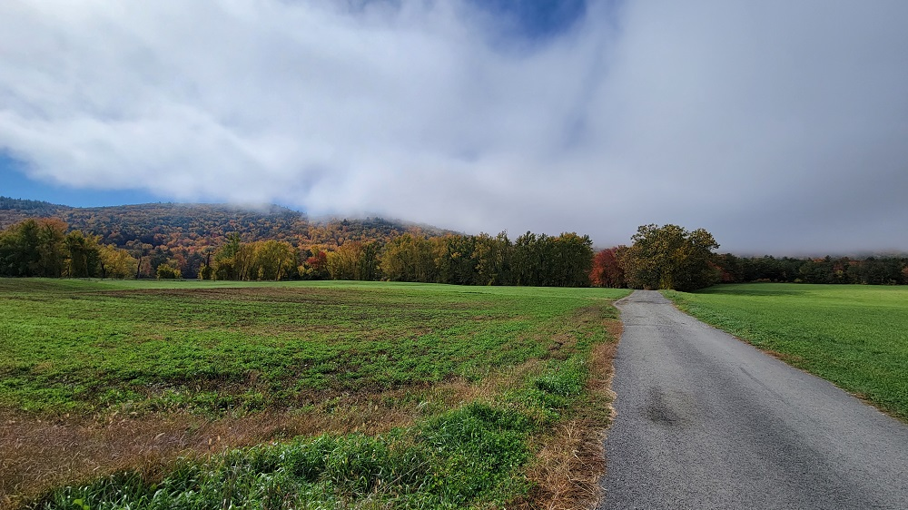

**Ride With GPS Links**

[Bellows Falls to Greenfield](https://ridewithgps.com/routes/41212683)

This ride was not part of my ride351 challenge. It was peak fall colors season in this part of Vermont and Massachusetts, so I decided to rent a car (I know, booo!) and drive up to Bellows Falls. While my original plan was to ride from Bellows Falls to Greenfield and take the Amtrak back up, I realized that I might not make it in time, so decided to cut the ride short, and drove down to Brattleboro and started from there. This proved good, because I got to spend some time for lunch in Greenfield before taking the train back up.

*Strava Route - Brattleboro to Greenfield*

Starting from Brattleboro (after a confusing half hour spent finding parking), I headed down south on Route 142. There is a large lumber mill with logs being sprinkled with water. I had never seen that before, and thought that is how they make mulch. Turns out, that's done to prevent fungal growth before the wood is dried for actual use.

*Lumber Yard, Brattleboro*

Moving a bit further south, I saw a really stunning image - orange-leaved tree, white fence, house, and green lawn. While I unfortunately did not take a landscape oriented picture, this vertical picture, along with one of my bike next to the Connecticut River looks pretty cool.

*Orange-leaved tree next to a white picket fence*

The next part of the ride was through a WMA (Wildlife Management Area) just across the Massachusetts border called Satan's Kingdom! I had biked along the edge of these woods on Bostreal Day-2, so it was interesting to ride through it this time. I am not a believer in co-incidence, or supernatural activities, BUT!! the moment I entered the Satan's Kingdom WMA, my front brake cable snapped. This is all that I am going to say in this matter. It was, however, a very beautiful wooded area.

*Approach to Satan's Kingdom*

*Biking on dirt roads, in Satan's Kingdom*

There was a very beautifully designed A-frame house somewhere on the route - the location of which, I am not going to intentionally disclose. With the orange leaves, and a river behind it, it looked classically 'fall'.

After I crossed over into Massachusetts, I took Route 10 west, and turned onto Route 63 South in Northfield. The rail-line connecting Vermont to Massachusetts goes from under the bridge at this point. I took these two really cool wallpaper-worthy pictures while waiting at the red light. (It was awesome to zoom straight ahead on the protected bike-lane, while cars lined up - haha!)

*Rail Line going to Vermont*

The next portion of my ride was through Cabot's Camp - you get a magnificent view of the French King Bridge from this point. The entire route to that point was excellent. I passed by a picnic spot, where a large group was having a barbeque - unfortunately I was not offered anything. The road also passed under the French King Bridge, and I got incredible views of the bridge from below. It truly is a majestic engineering marvel.

*Riverview Picnic Area, Northfield MA*

*Below the French King Bridge, Erving MA*

My personal discovery of Cabot Camp happened when I was planning the ride from Orange to Greenfield, and had to find a way to cross through as many towns as possible. Unfortunately, I could not go through Cabot Camp, as it would've added a lot of time to the ride, so I had skipped it. Turns out, that was probably a good decision, because the views of the approach to Cabot Camp, and the views of the French King Bridge from there were brilliant in the fall!

*Approaching Cabot Camp, Millers Falls (Montague), MA*

*Two-photo panorama of the Connecticut River, and the French King Bridge from Cabot Camp*

Turners Falls is a small historic mill town at the confluence of the Connecticut and Deerfield rivers, right across from Greenfield. With the post-industrial economic decline of mill-towns, this town was also affected. I saw an abandoned rusty water tower that seemed to be straight out of a movie set, and a strawberry field just across the river from it.

*Rusty looking water tower, and fields of strawberry*

It was towards the end of the ride, and I just had to get to Greenfield, catch a lunch, and be on my way back to Brattleboro where I had parked my rented car. The Connecticut River Bridge, which connects the southern parts of Turners Falls and Greenfield is closed to all traffic, but there is a rail-trail bridge for bikes and pedestrians very close-by.

I mentioned in a previous post that the John W. Olver Transit Center is a green building, with a very modern design. I got there, locked my bike, and had an entire pizza for lunch.

*John W. Olver Transit Center, and me inside the Amtrak heading back to Brattleboro*

I did not ride through any new towns within Massachusetts - nor through Vermont! On Day-2 of Bostreal, we biked through Vernon and Brattleboro, but as you hopefully realized through the pictures, it was 100% worth it.