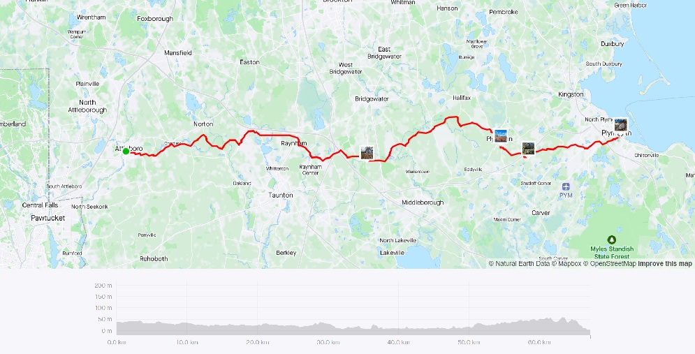
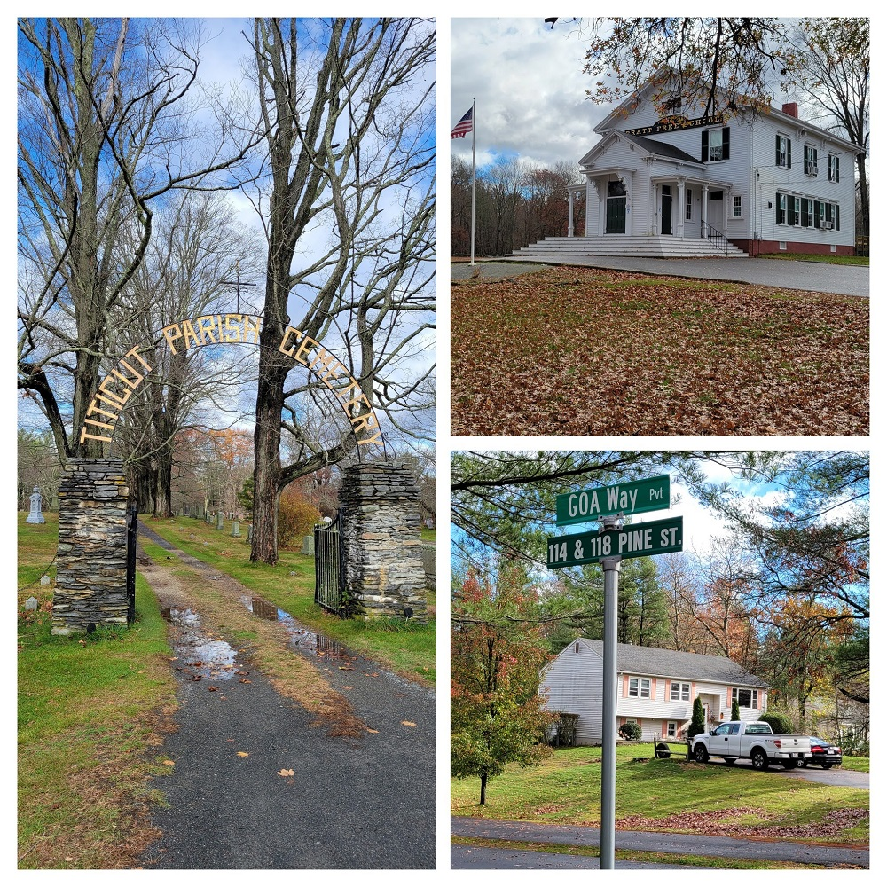
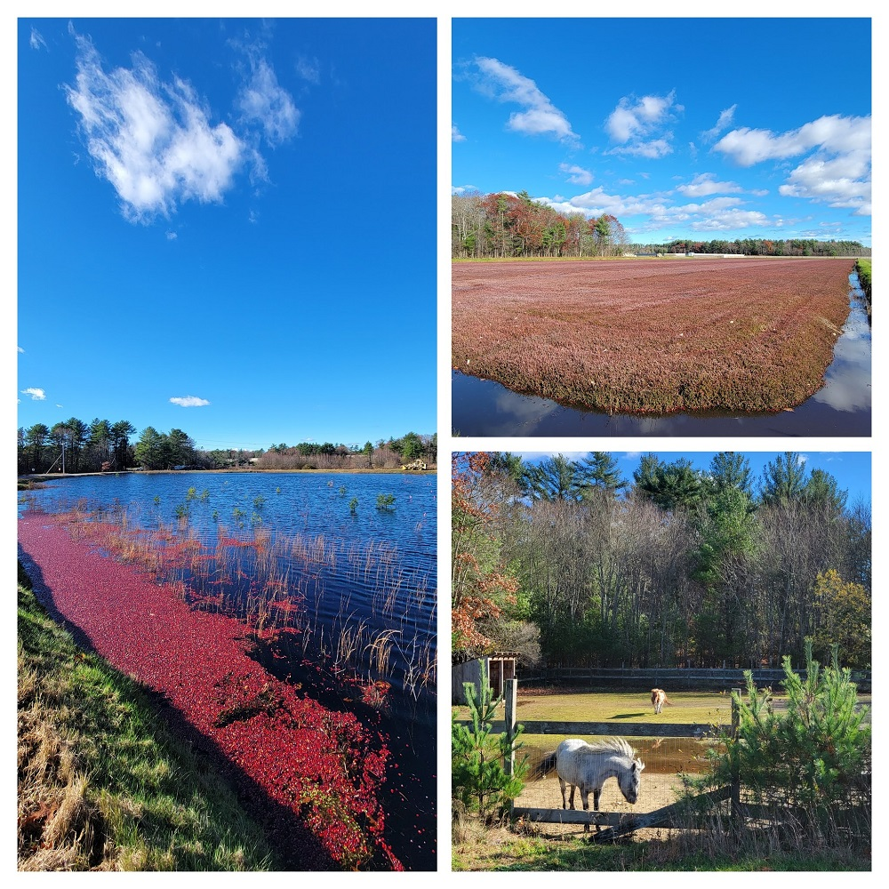
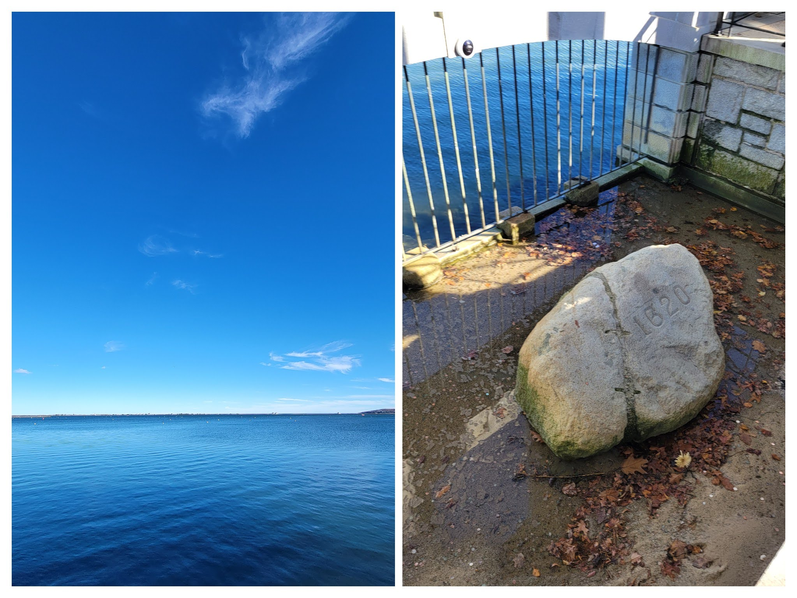
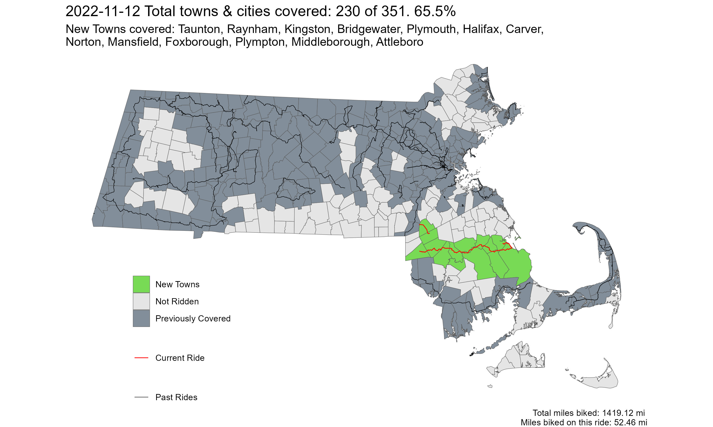

**Ride With GPS Links**

[Attleboro to Plymouth](https://ridewithgps.com/routes/41400158)

After a long time riding out west in the Berkshires, this was the first time in a long time I was riding in the Boston area. I was dreading this portion of the region - and rightfully so. The suburban, car-centric development in this part of the state leaves a lot to be desired, and it was relatively hostile environment to bike in.

*Strava Route - Attleboro to Plymouth*

### *The Ride*

While the first half of the ride was relatively unpleasant, the parts after Middleborough were through what I like to call, and the source of the ride's name - Cranberryland. The parts around Carver and Halifax are large cranberry producing regions. I was a bit late in the season, and went riding just after prime harvest time, but it was still a very interesting view with crimson colored bogs.

*Titicut village in Middleborough, MA*

*Cranberry bogs and a Shetland pony*

The ride ended at Kingston MBTA station, but I stopped for a little bit at Plymouth, to check out Plymouth rock. (cool)

*Plymouth Rock, and the absolutely beautiful Cape Cod Bay*

Overall, I covered 13 new towns -Taunton, Raynham, Kingston, Bridgewater, Plymouth, Halifax, Carver, Norton, Mansfield, Foxborough, Plympton, Middleborough, Attleboro - bringing the total to 240/351 - 65.5%, almost two-thirds done!

Fun fact: Attleboro is the only 'boro' town to have that as the official suffix.

