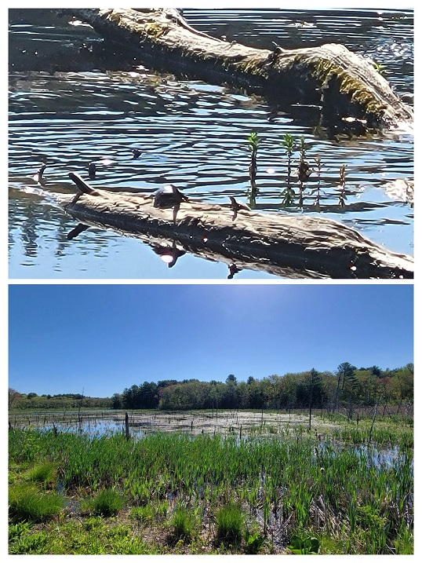
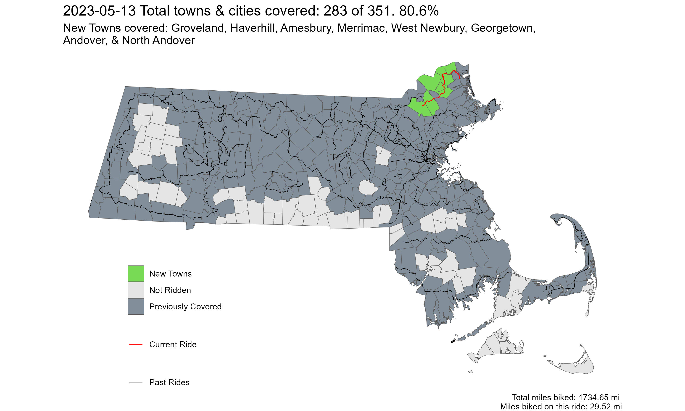

**Ride With GPS Links**:

[Day 1 - Greenfield to Worthington](https://ridewithgps.com/routes/42785718)

[Day 2 - Worthington to North Adams](https://ridewithgps.com/routes/42815679)

The northern Berkshire Hills area, followed by the northern half of the Pioneer Valley is probably my favorite place to ride in all of Massachusetts. There are enough low- to no-stress roads here that aren't as isolating as rail-trails. Despite the steep hilly roads, it is really peaceful to ride here.

One of my most favorite rides - [the towns north of Route 2](https://ride351ma.bike/post/2022-08-21-rural-ridin/) - was also the most hilly ride I've ever done in Massachusetts.

 
*Main Street near Ipswich Road, in Boxford*

 
*River Road, near the town-line of Merrimac and Haverhill*

 
*Wildlife in the Crane Pond Wildlife Management Area. Turtles and (not pictured, but 100% DEFINITELY there) snakes!*

 
*Strava Route - Mad Merrimac Meander*

Overall, I covered 8 new towns - Groveland, Haverhill, Amesbury, Merrimac, West Newbury, Georgetown, Andover, and North Andover - bringing the total to 283/351 - 80.6%!

