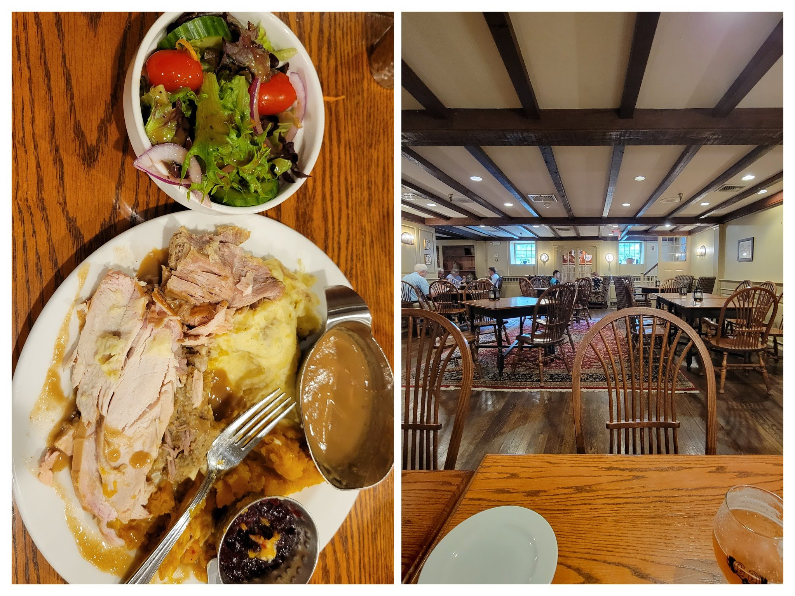
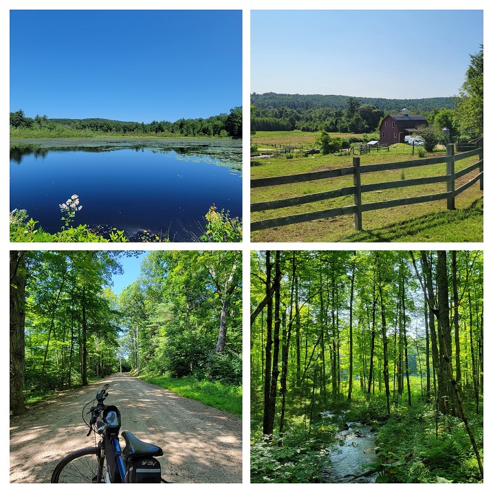
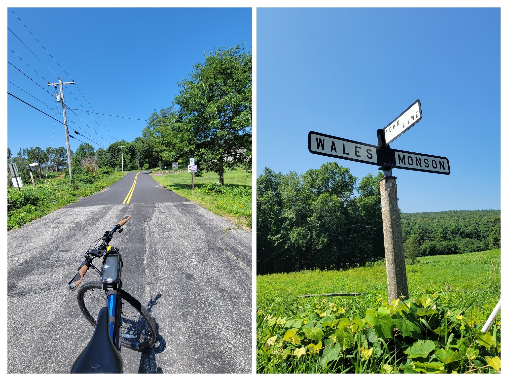

**Ride With GPS Link**

* [Day 1: Franklin to Sturbridge](https://ridewithgps.com/routes/42658463)
* [Day 2: Sturbridge to Springfield](https://ridewithgps.com/routes/42664054)
* [Chicopee-Ludlow Loop](https://ridewithgps.com/routes/43477246)

This route covered the long line of towns along the eastern half of the border with Connecticut, and northern border of Rhode Island. I had been dreading doing this route for multiple reasons - but mostly because a large portion of it was along relatively busy roads. I had wrestled with many different ways of covering these towns, including overnight stops. One option included going along the MA-CT-RI tri-point, and through CT into Webster, however, I continued along Rt 16 only. Another involved 3 different loop routes, from Franklin, Worcester, and Springfield respectively to cover these towns. However, I decided to do a single two-day trip.

The core of this route is part of '[The Last Green Valley](https://thelastgreenvalley.org/)' - a region contiguous with eastern interior Connecticut with a rural and forested character. It is a National Heritage Corridor, contiguous with the [Blackstone River Valley Heritage Corridor](https://blackstoneheritagecorridor.org/) - which forms the eastern portion of our route as well. Both are NPS sites.

#### Day 1 Franklin to Sturbridge

I took the first [Franklin line](https://www.mbta.com/schedules/CR-Franklin/timetable) train out of South Station to Forge Park/495 in Franklin. The Forge Park/495 station is a classic neo-suburban commuter rail station with a sea of asphalt parking around it, close to a stroad and highway exit. Hey - it keeps a few cars outside the city - no hate.

At mile 6/7, the route dipped into Woonsocket, RI, before getting into Blackstone, MA. This portion also co-incides with the Blackstone River Viaduct portion of the Greenway - the construction of which had started just days before my bike ride. The trail went for 4 miles after which I needed to get on to a regular road.

*Blackstone River Trail in Massachusetts*

The next point of interest was in the town of Webster. The main lake in the town has the distinction of having the longest place name in the United States. While it has multiple names, 'Lake Char­gogg­a­gogg­man­chaugg­a­gogg­chau­bun­a­gung­a­maugg' is the name used by many town locals and the town administration itself - most likely to capitalize on its unusual length. A quick Wikipedia look mentions that the indigenous Nipmuc people who spoke Algonquian languages, had multiple similar sounding names for the lake.

*Webster Lake, or Lake Char­gogg­a­gogg­man­chaugg­a­gogg­chau­bun­a­gung­a­maugg*

Webster was also at the 30th mile of the ride, and I had scheduled a lunch stop here at a Nigerian-Ghanaian restaurant called [Afro-Fusion Restaurant](https://maps.app.goo.gl/1rFqie3wZU4HRQCaA) I had an absolutely delicious jollof rice with beef stew and grape soda for lunch. That rice made me so sleepy, but I was marginally comforted that I only had 15 more miles left.

*Jollof Rice with Beef Stew, and Grape Soda at Afro Fusion Restaurant, in Webster, MA*

The next stop of interest was in the town of Southbridge, at the [Optical Heritage Museum](http://www.opticalheritagemuseum.com/). I had first seen this in [Atlas Obscura](https://www.atlasobscura.com/places/optical-heritage-museum) when I first moved to Massachusetts in 2018. I have been wearing glasses since I was 7 years old, so this made it an even more interesting place to visit. It is a small museum, supported by ZEISS, and curated by a long-time employee of the erstwhile American Optical company, which operated out of a factory in Southbridge (you actually pass by this building on this route!). The museum is free to enter with a suggested $5 donation, but check the timings on their website.

*Optical Heritage Museum in Southbridge, MA*

The thing I disliked about this route is the relatively steep portions (thankfully short), but on heavy traffic roads which made it unpleasant. The portion between Southbridge and Sturbridge where I was supposed to spend the night had a short 9.2% grade section on a heavily trafficked road with a very narrow shoulder - AND ON A CURVE. Not pleasant at all, and would absolutely not recommend for high-comfort riders. Sturbridge, however is home to the [Old Sturbridge Village](https://www.osv.org/) (which I did not visit, but comes recommended) - a living history museum, where an old colonial New England village is recreated with actors wearing clothes and doing activities of the day.

I spent the night at the [Publick House Historic Inn](https://publickhouse.com/) - which dates from 1771. They have a cheaper motel-like part where if you check in after 6pm, you can get a discounted rate - which is what I did! I had the highly recommended Thanksgiving Turkey Dinner at their restaurant, which was excellent.

*Thanksgiving Turkey Dinner at the Publick House Historic Inn, Sturbridge, MA*

#### Day 2 - Sturbridge to Springfield (and the Chicopee-Ludlow loop)

As the sub-title suggests, day 2 was for riding 37 miles to Springfield from Sturbridge. The route today was much nicer (except the Chicopee-Ludlow loop, which we'll come to later), as it was mostly off major roads, through rural-ish areas. The views on much of the route reminded me of the nicer parts of Western Mass., and Vermont with rolling hills, barns, packed earth trails, forested areas, and ponds everywhere.

*Views along the route of Day 2*

The funniest example of municipal indifference and borders was visible at the Monson-Wales border where I crossed. You don't need a sign to tell you where the border is!

*Border between Wales and Monson*

While I did not take pictures, the portion of the ride through Forest Park in Springfield was really nice. Designed by Olmsted's firm (although not himself) it is a very famous green space in Springfield. I have ridden down Main Street in downtown Springfield countless times now, heading towards Union Station, so the portion of the route after Forest Park was very familiar to me. I ended the ride with a beer, wurst, and giant pretzels at the German restaurant [Student Prince Cafe and The Fort](https://www.studentprince.com/).

 
*Strava Route Day 1 - Franklin to Sturbridge*

 
*Strava Route Day 2 - Sturbridge to Springfield, and the Ludlow-Chicopee loop*

Overall, I covered 20 new towns - Webster, Brimfield, Longmeadow, East Longmeadow, Holland, Douglas, Dudley, Hampden, Wilbraham, Wales, Monson, Chicopee, Ludlow, Sturbridge, Southbridge, Bellingham, Uxbridge, Franklin, Blackstone, and Millville - bringing the total to 340/351 - 96.9%!

